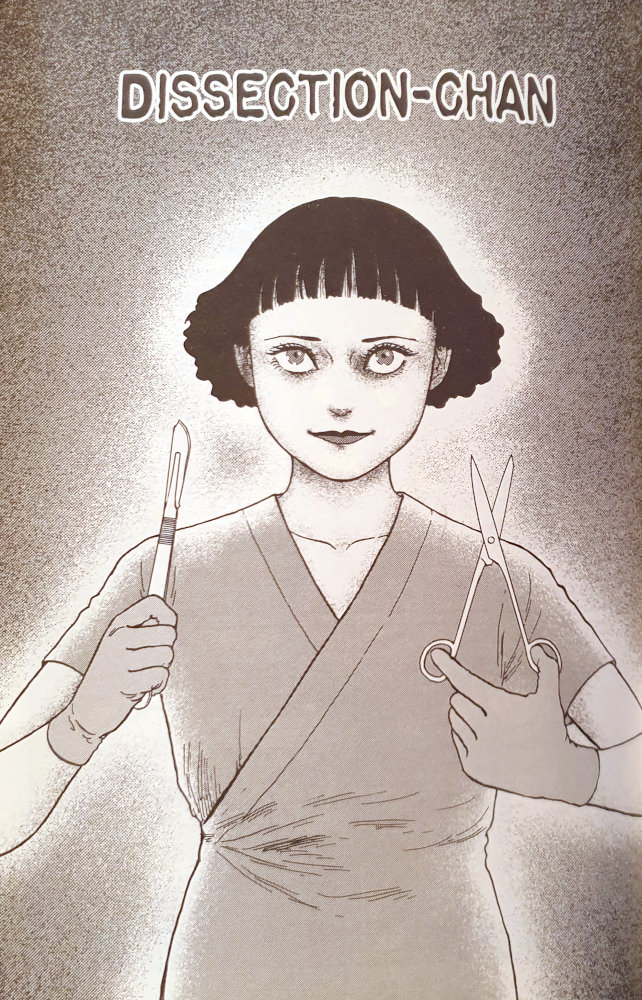
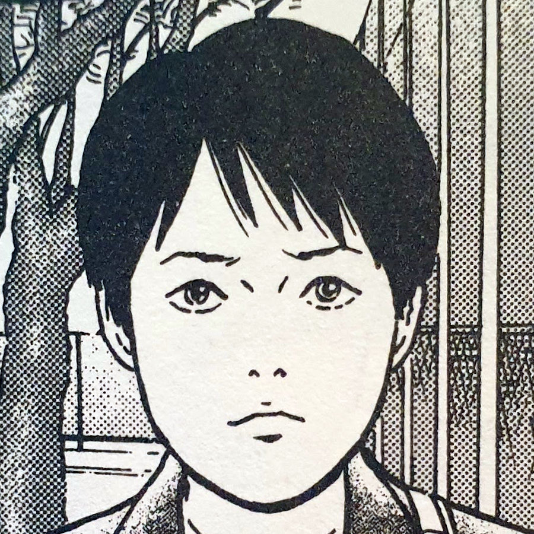
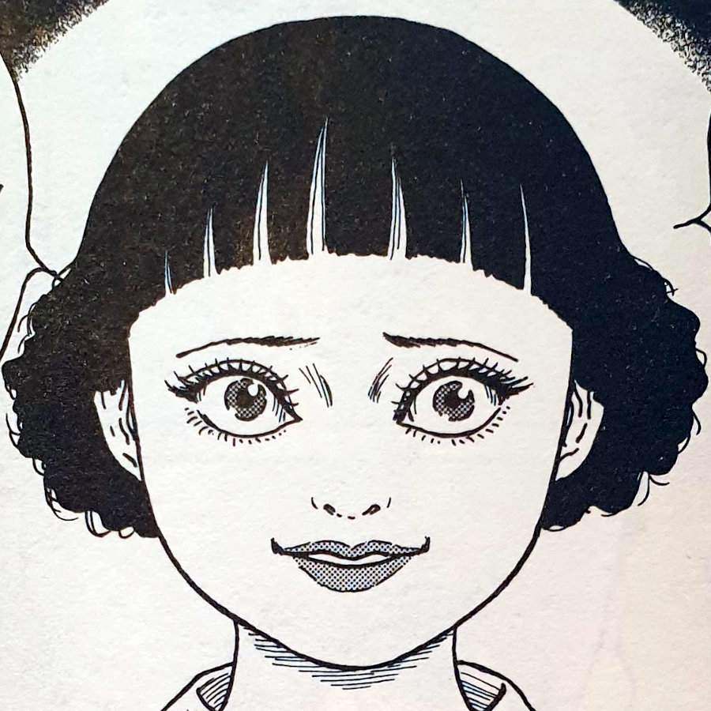
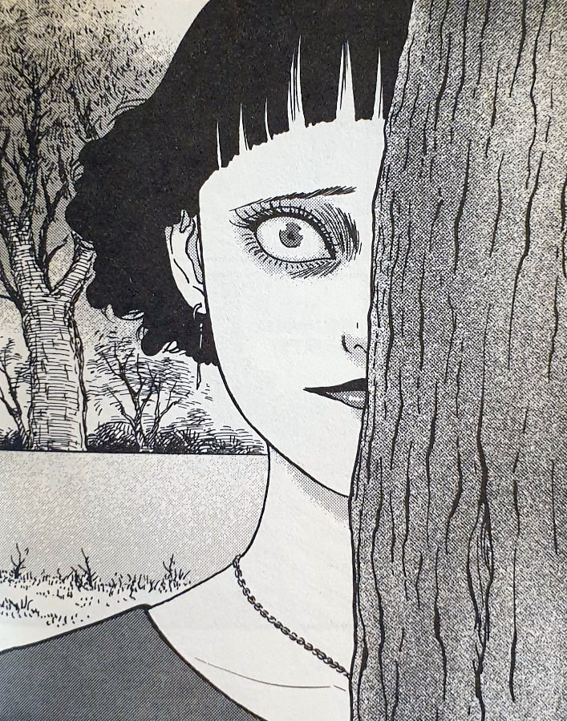
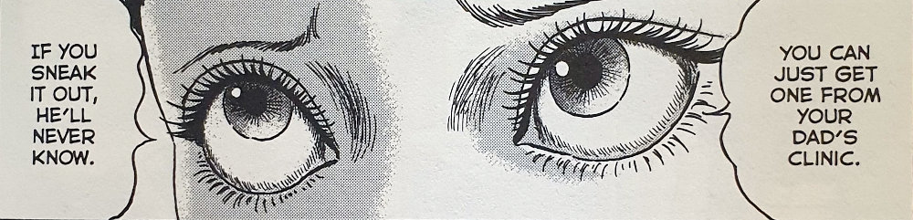
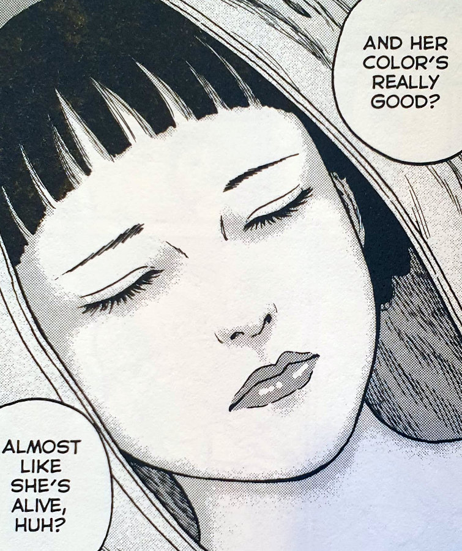

> Well, this is where you come to be dissected, right? I want to be dissected!
> 
> Ruriko Tamiya has a very particular taste

## Dissection Chan -- synopsis

At a local hospital a group of medical students are preparing to start their curriculum on the dissections of cadavers. As each of the student groups opens their body bag they find the old, frail bodies of the dead. People who have graciously donated their bodies to the advancement of medical science.

However, there is one group who conversely find a fresh-faced young woman. Fresh- faced enough that she could almost be mistaken as being alive. And then when she twitches a smile and opens her eyes, the students are stunned. They are greeted by a young woman who is begging to be dissected!

She soon runs out of the theatre laughing to herself. The students are left in shock. All except one, who is sure he recognises the woman from his past. This trainee doctor's name is Tatsuro Kamata. But just how does Tatsuro know this woman? And where will she appear again?

Tatsuro Kamata

Ruriko Tamiya

## Journey of a psycho

Dissection Chan is, for me, one of the more disturbing stories by Junji Ito. It is also incredibly original and takes a common backstory of psychopaths and gives it an interesting spin.

When hearing those common backstories, especially in criminal investigation programmes, psychopaths often have a similar backstory. They would normally have been known to cut up small insects as children. They will often then graduate to rodents; then sometimes to cats or dogs; before becoming the vicious killer of humans that they are seemingly destined to be.

In Dissection Chan, the title character Ruriko Tamiya journeys along that same path. She begins cutting up frogs, with the aid of a helpless young Tatsuro -- the trainee doctor from the story's opening, and soon gets a hunger for larger animals. Before long she is chasing her friend with a scalpel, looking like she's almost ready to become the killer she is seemingly growing into.

But what Ito does, very imaginatively, is take those psychopathic tendencies and turn them inwards. Ruriko becomes obsessed with wanting to be dissected herself.

Peek-a-boo Ruriko

## Self destruction

Human's are often described as having a tendency towards self destruction. Now, I am not a psychology student -- my levels of psychology knowledge come from films and [Derren Brown](http://derrenbrown.co.uk/). Specifically I remember in [Terminator 2](https://en.wikipedia.org/wiki/Terminator_2:_Judgment_Day): Arnold Schwarzenegger saying to John Connor, about human beings, that "It's in your nature to destroy yourselves".

I have also discovered this idea in other stories by Junji Ito. The one that springs immediately to mind is [The Enigma of Amigara Fault](https://junjiitomanga.com/the-enigma-of-amigara-fault/). In it, people are drawn to the pitch black tunnels in an earthquake fault line carved out in perfect human silhouettes.

Just like the people that are drawn to their own holes in the wall, despite it meaning certain doom, so to is Ruriko drawn to her own doom. Being dissected, if not already dead, would definitely kill you, and she is very aware of this. But maybe the very same "Death Drive" exists in her, making the last few panels of this story inevitable.

## The sickness inside

The closing panel to Dissection Chan is one of my favourites of all of Ito's stories I've read so far. The insides of Ruriko's body are like something out of a living nightmare. It's almost as if the souls of the things she's dissected and killed over the years have become part of her.

It definitely explains the stomach pains she suffers from.

On a metaphorical level, it feels like it is the sickness inside her that is driving her obsession for dissecting. Something started long ago has being developing inside her. And by the looks of her insides, it is not only driving _her_ to her actions and desires, but it is something she has been feeding too.

It is almost as if her desires in her early days have made way for a biological _need_ to be dissected as of late -- in order to let out of her body the rotting, mixed-up living things that have developed inside her.

Ruriko's life and her physical body are definitely the result of a very grotesque vicious cycle.

And then there is the sexual deviancy side to it all.

Not only is this woman obsessed with dissection, but in her later years she becomes sexually attracted to it. Soliciting men and begging them to cut her open; then appearing at Tatsuro's home, as naked as she was on that hospital table, screaming her mantra: "Dissect me!".

Junji Ito isn't one to shy away from such sexual scenarios. I remember another character of his from [Wooden Spirit](https://junjiitomanga.com/wooden-spirit/), who was depicted as being sexually attracted to the old historical home in the story. Crazy stuff.

## In Summary

Dissection Chan is incredible. It touches nerves that you possibly don't know you have. It may even make you question what is possible in the realm of horror and horror manga.

The depictions throughout the story get disturbing at times, but nothing so disturbing that would put you off any of Ito's other works.

In fact, I would argue that this story is one of the best examples of an Ito horror manga to give you an appetiser for his other stories. It is definitely one of the first I read in the [Fragments of Horror](https://junjiitomanga.com/tag/fragments-of-horror/) collection, and is one I often re-read as well.
