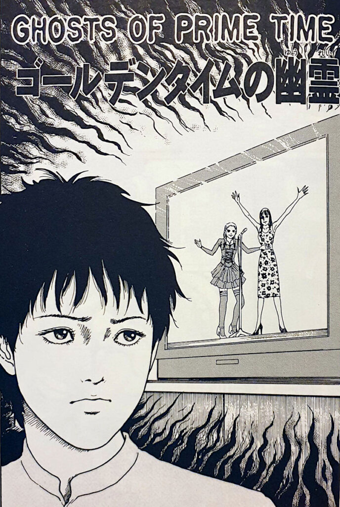
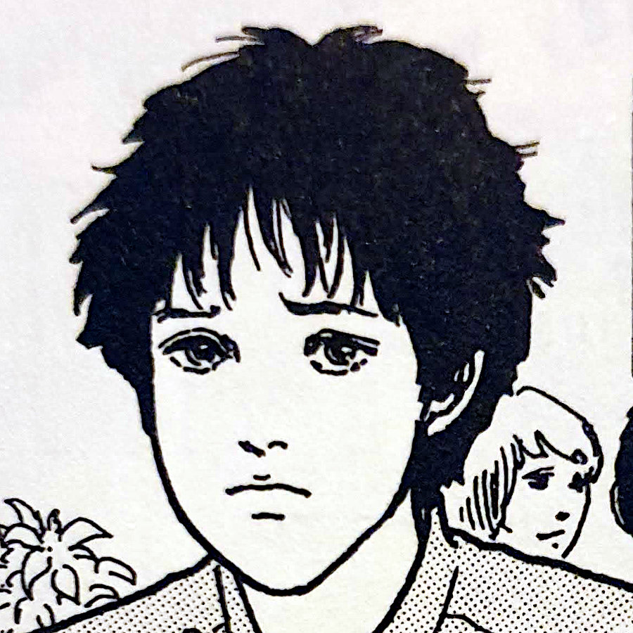
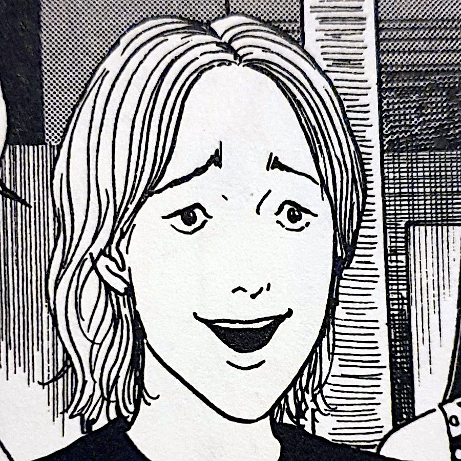
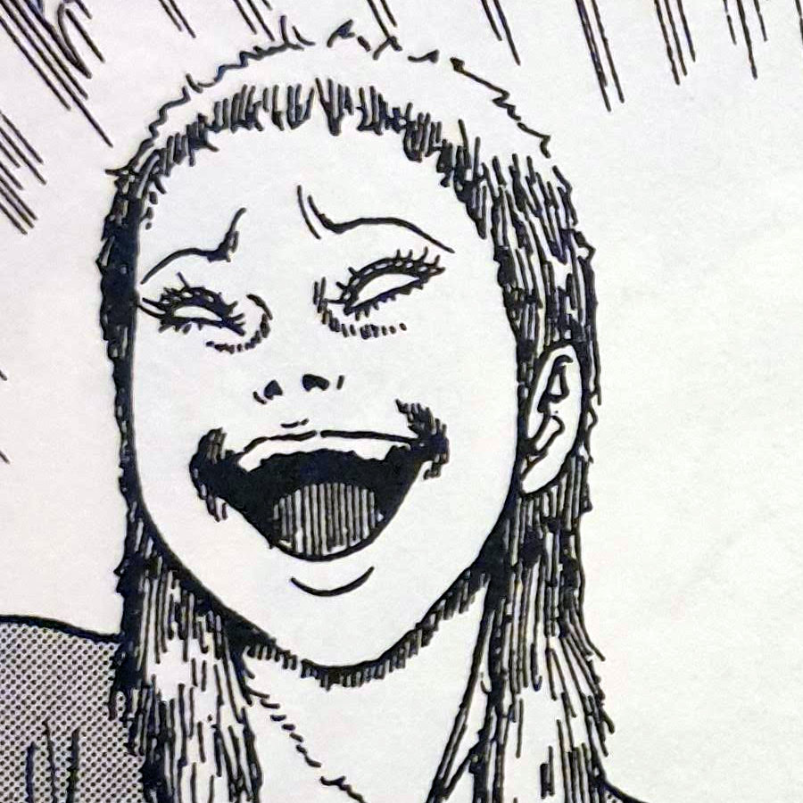
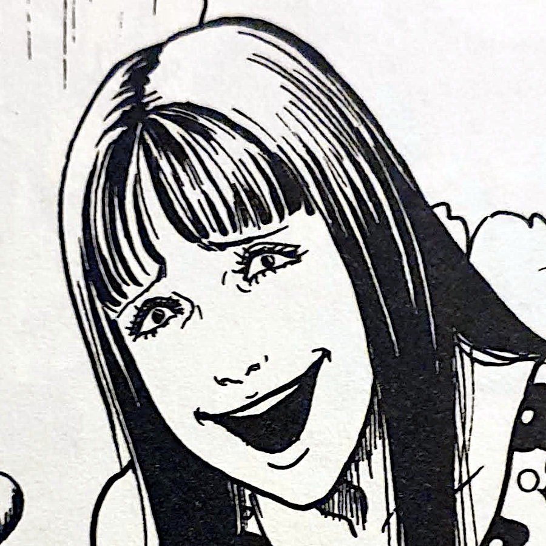
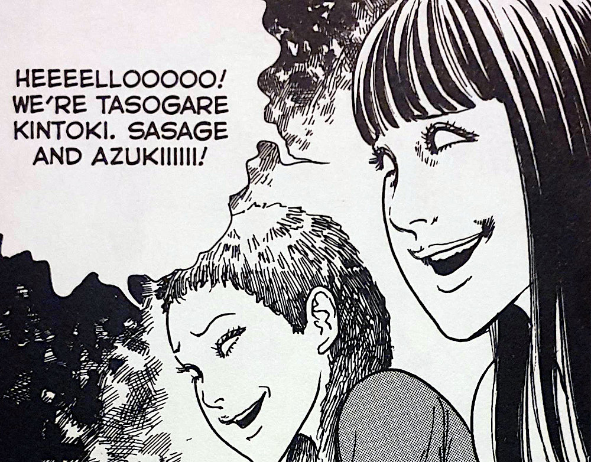
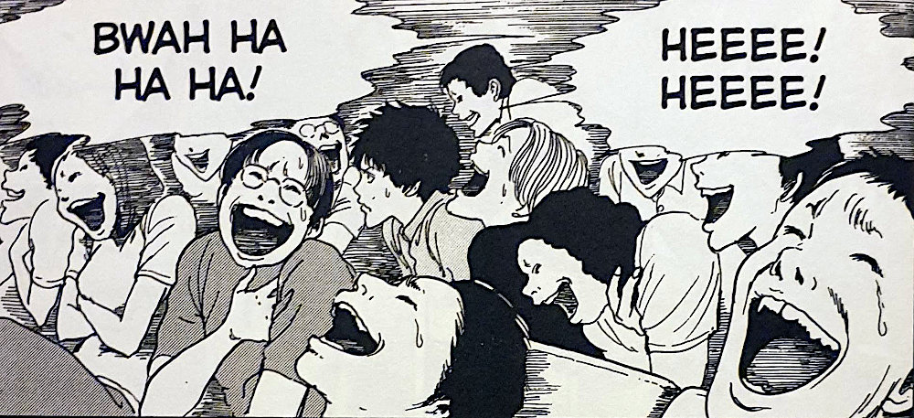
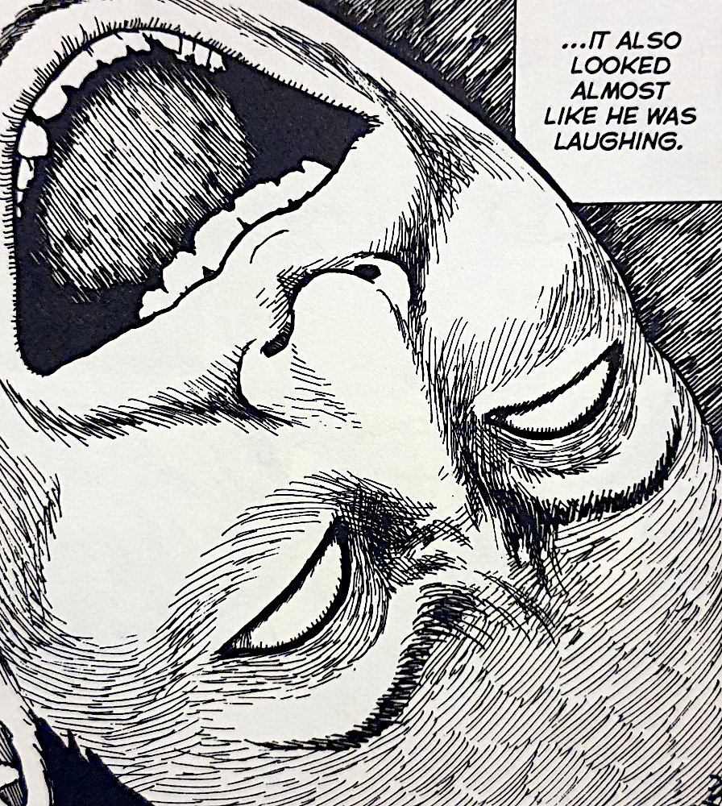

> ...but we're makin' things happen with our comedy. We'll take control one o' these days!!
> 
> Tasogare Kintoki says some strange things during their comedy routine

## Ghosts of Prime Time -- Synopsis

Keisuke and Tsuguo are two friends talking in a small cafe. Tsuguo is an every day regular young man, whereas Keisuke is more withdrawn and "gloomy".

Tsuguo tells his friend of a story of a recent local killing of an obscure comedian. The comedian was found in the street with an expression of equal parts suffering and laughter.

Later that day, the two friends go to a local comedy club - Tsuguo wanting to cheer Keisuke up - to see the comedy lineup. One of these acts in the line up is the aforementioned duo Tasogare Kintoki.

Tasogare Kintoki are objectively bad at comedy. Their jokes fall flat and most of their banter is regarding how they will one day "make it big" and live in a mansion. A very strange double act indeed.

However, after a few moments of complete silence with the odd whisper, one audience member begins laughing uncontrollably. And then, just as Tsuguo comments on this strange occurrence, another person does the same. The effect starts to repeat through the audience until the entire club is in a vicious roar of laughter. That is, everybody except for Keisuke.

There is no doubt that something is not right in that comedy club, but what is it? Keisuke is the only one not affected, but what does he have that the others don't? And what might Tasogare Kintoki do when they realise that there is one person seemingly immune to their unique brand of comedy? Their sinister grins promise a future of pain and torment.

Keisuke

Tsuguo

Azuki from Tasogare Kintoki

Sasage from Tasogare Kintoki

* * *

Some spoilers below

* * *

## Horror and Comedy

Horror and Comedy are very closely related. Both genres have a willingness to go over the top with absurdity and exaggeration. While comedy uses it's exaggerations to poke fun and make its audiences laugh, horror conversely uses it's own to scare and unsettle its audience.

But what's often more interesting, at least to me, is when an artist manages to combine the two into something often greater than the sum of the parts. Many people often cite Quentin Tarantino's famous ear-cutting scene in his first major film, [Reservoir Dogs](https://en.wikipedia.org/wiki/Reservoir_Dogs). (Despite never actually seeing the cutting itself, audience members still tending to look away)

What I think Junji Ito has managed to craft here though, is a different way of blending horror and comedy. Instead of taking the elements of both genres to make his story a "horror comedy", he has actually taken horror and made it infect the comedy inside the story. I am referring to the fact that the laughter and enjoyment apparently felt by Tasogare Kintoki's audience, is in fact the direct result of the phantoms/ghosts that they project out into the crowd.

I think the blending of genres is always interesting to see. But I especially liked here how Junji Ito hasn't necessarily blending the _genres_ together. He has instead kept this as a horror story, but used the comedy within the narrative as the vehicle for that horror.

## Faces of Comedy

Junji Ito has always been an artist who draws great facial expressions. Especially faces of pain and obsession. In Ghosts of Prime Time, he has on display some brilliant faces of extreme laughter and, of course, pain.

The first example is actually on the very first page -- the story of the obscure comedian who is found dead in the street. The close up of his face does indeed show laughter at the time of death. But so to it manages to put across pain and suffering from, I believe, the completely white eyes and taught muscles around the neck and face.

And I can't mention the faces in this story without mentioning Tasogare Kintoki themselves. Their expressions always that of faces on the cusp of laughter, sometimes without pupils in their eyes. Almost like they are being possessed at times. And despite their smiles, they are always projecting a sinister intent towards all those who see them.

## Poker face Keisuke

Keisuke definitely takes on the role as the sane compass centre in Ghosts of Prime Time. He reminds me a little of Shuichi in the [Uzumaki collection](https://junjiitomanga.com/tag/uzumaki/). Whilst all the craziness is going on around him, he seems to stay grounded and be able to look objectively at those things.

Just as Shuichi seems to be able to detect and know of the spiral's control within his town, so to does Keisuke in _his_ town. He can see the spirits that leave the bodies of Tasogare Kintoki to tickle the audience into submission. He knows they are not to be trusted and warns his friend of that.

I think these sorts of grounded characters are important to these stories. Without them we would just see the events unfold with no-one really to fight back. But Keisuke does fight back -- and with gusto.

The obscure comedian found dead

## In Summary

I really love Ghosts of Prime Time. It doesn't seem to be as well known or regarded as Junji Ito's more popular stories like [Tomie](https://junjiitomanga.com/tag/tomie-collection/) or [The Bully](https://junjiitomanga.com/the-bully/), for example. But I want to change that! This story is, as are most of Ito's works, wholly unique.

I believe this one would be a perfect first story of Ito's to read if you were looking to get into his stuff. Especially if you wanted to avoid the kinds of body horror that come with so many of his more celebrated works.

And believe me when I say that it will become a journey for you. Because once you have read this story, you will most likely want to start exploring his other great works too.
