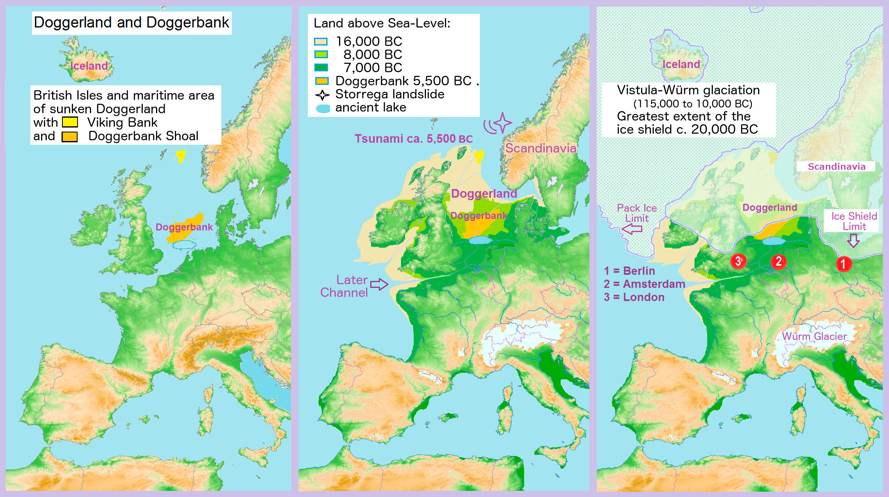

- Covering 70,000BCE to about 100BCE

- 70,000BCE start of the last ice age, temperature dropped by less than 10oF

- There were Woolly Mammoths and Giant Deer in Britannia

- 40,000BCE neanderthals started arriving to Britannia

- 30,000BCE modern humans started arriving to Britannia

- 22,000BCE A "cold snap". Britannia became a treeless tundra for 1,000s of years.
    - Everything went south.
    
    - Things that did stay adapted to the dropping temperature.
    
    - Sea level was about 417 feet lower than it is today
    
    - Britannia was connected to both the continent and Ireland

Doggerland was the connecting area of land that connected britannia to the continent that, by around 6,500BCE, was completely underwater:

Map showing the location of Doggerland and Doggerbank

14,000BCE

- People started arriving back to Britannia as the temperatures began to rise again. The came from southern France and Spain.

12,000BCE

- End of the last Ice Age.

- Ireland is split off from Britannia completely.

- Britannia still just about connected to continent by a land bridge

- Woodlands began coming back

- Humans begin using small flint tools

- Many animals dying out due to rising temperatures. That, and the humans hunting them.

7,150BCE

- Cheddar Man
    - Man of about 21 years old
    
    - From the Cheddar Region
    
    - Died due to a blow on the head
    
    - Marks on his skeleton due to bones being scraped clean:
        - This is thought to be either burial rituals (secondary burial)
        
        - Or possibly cannibalism
    
    - He is related to at least two residents of modern-day Cheddar
    
    - Also related to about 11% of modern European population

- The land from Britannia to continent becoming marshy.

6,500BCE

- Doggerland now completely sank into the channel

- Britannia is separated from the continent.

4,000BCE

- Britannia hits the Neolithic Age (aka New Stone Age)

- Britannia Population of about 10,000

2,500BCE

- Stonehenge was built.

1,000BCE

- Hill forts begin popping up across country.

- Britannia now in Bronze age, whilst the rest of Europe was in the Iron Age.

700BCE

- Iron begins being introduced into Britannia.

- There was a slow switch over to Iron, probably sped up by warring tribes wanting the upper hand in battle.

500-400BCE

- Celts begin arriving from France and Northern Spain

- At least 2 groups of Celts:
    - Goidelic (which became Gaelic) - Settled in Ireland around 350BCE
    
    - Brythonic (which became Welsh, Cornish and Briton)
    
    - Celts as a whole came from the Hellstat Territory in central Europe around 6th Century BCE

- Britannia was actually known of Albion, from the Latin word meaning white.

325BCE

- Greek navigator Pytheas arrived on shores of Britannia
    - Had a way of navigating and mapping the island by putting a stick in the ground and noting it's shadow at various times of the day.
    
    - The name Britannia came from him calling the people he found "Pretani", meaning "The Painted People" - This made "Pretannike" - The land of the painted people. In Latin P's often substituted to B's and so became Britannia.

- Distinct cultural groups
    - Coastal people -- often traders.
        - Kent was most advanced
    
    - Inland people -- often hunters and scavengers.

- The way the land was meant that many communities were small in size.

200BCE

- Trade is increased

- Contact with Greece emerges due to the widely available Greek coins.

- Major exports from Britannia were thought to be Tin, Copper and Hunting Dogs.

100BCE

- Gallo Belgic coins start appearing.
    - Believed to be due to people accepting payments from military services.
    
    - Some Britons were mercenary fighters for hire.

- "Oppidum" sites increasing -- this is according to Caeser.
    - Large walled towns often in thickly wooded areas, protected by ditches.

- Britannia was largely an agricultural economy.

- Population now around the 1,000,000 area.
    - They spoke a Celtic language

- The "Traditional English countryside" pretty much had its beginnings at this point.

- The Religion of the time was Druidism.

- Discovery of Lindow Man in a peat bog at Lindow Moss near Wilmslow in Cheshire
    - Possibly struck on the head (but not killed)
    
    - Then strangled (but not killed)
    
    - Then his throat cut.
    
    - Mistletoe pollen found in his stomach.
        - A possible back up for the claim by Romans that the Druids did human sacrifice.
