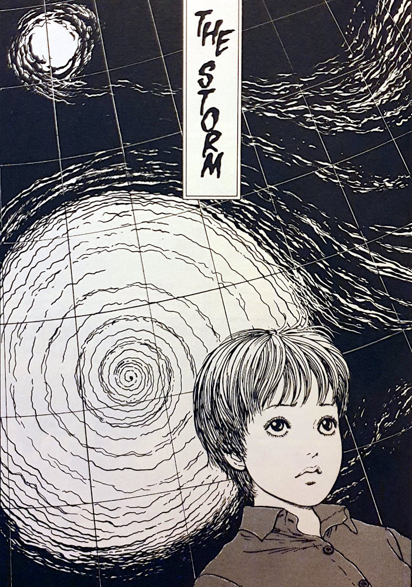
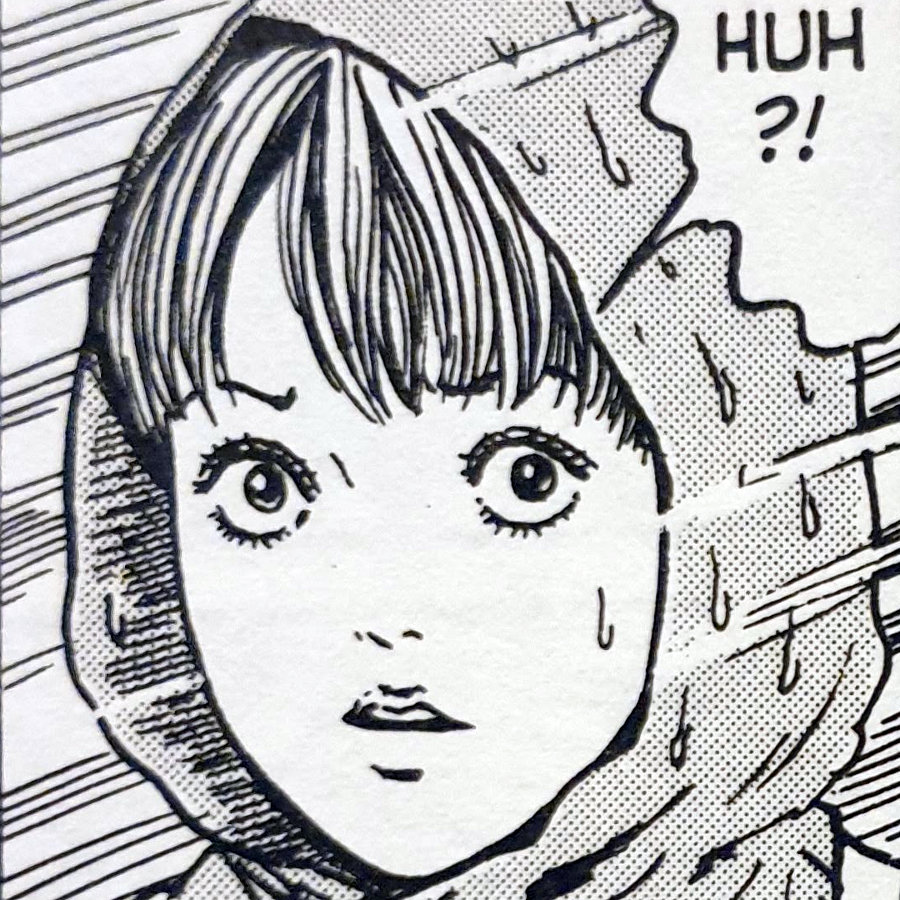
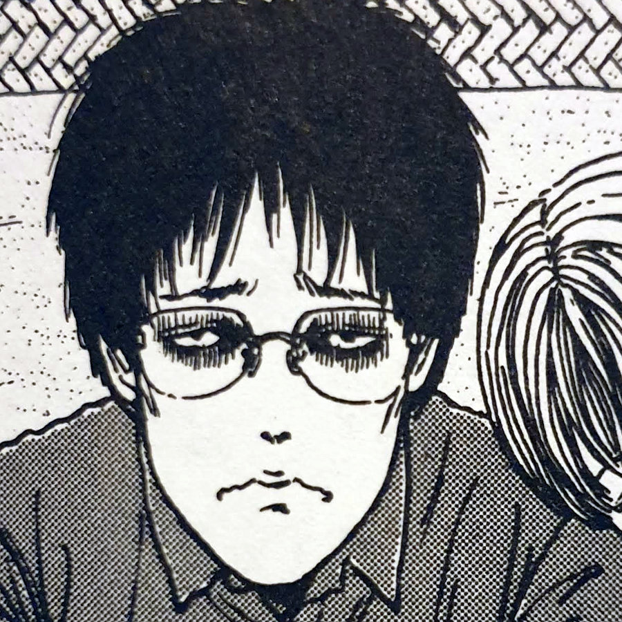
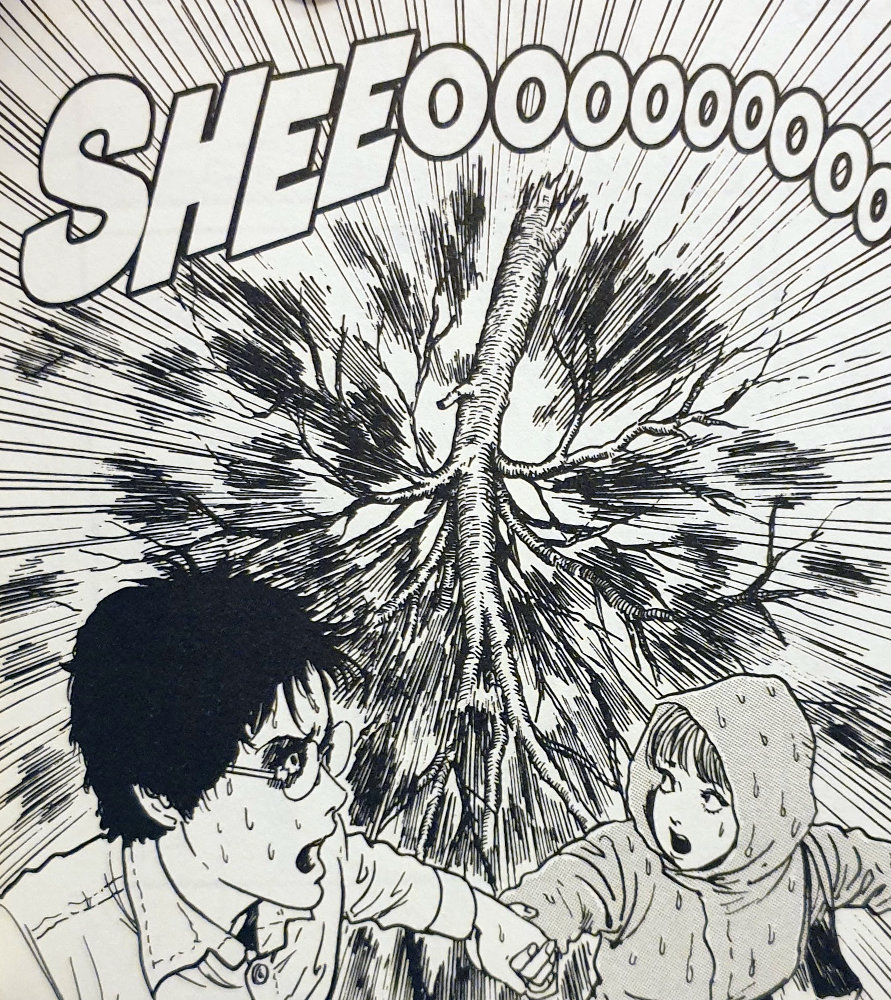
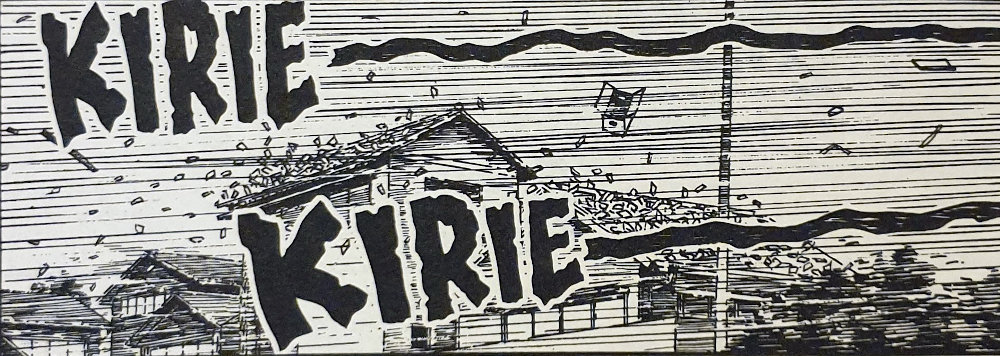
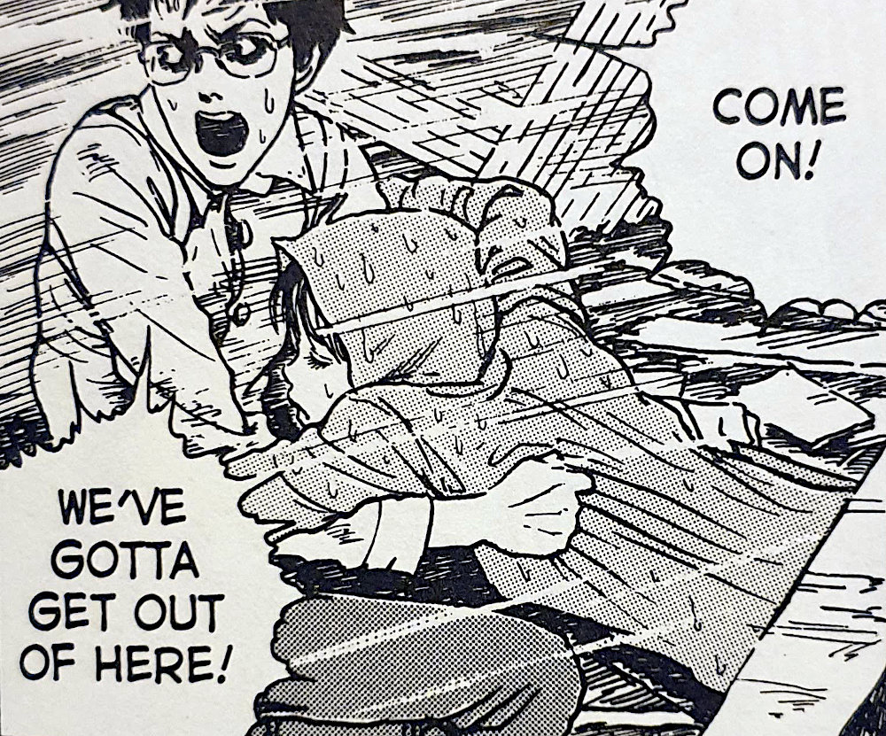

> Didn't you hear the wind last night? The voice of the storm was calling your name!

Kirie is the target of the spiral that haunts Kurouzu Cho, as it seemingly controls a violent typhoon to hit the town hard. As her close friend Shuichi and Her sit on the beach together, Shuichi gets the feeling of the approaching typhoon before the weather forecasters soon confirm it.

Before long the typhoon tears through the town, destroying homes and the streets surrounding them. Kirie does attempt to still take some food to Shuichi that evening but it looks that she is put off by the storm's power -- coupled with the fact that it seems to call out her name on the wind.

All through the night the storm seems to be calling out to Kirie, which confirmed a long-standing theory of mine: the spiral curse is targeting Kirie for some strange reason. As she makes her way to Shuichi's the next day, He finds her walking halfway there -- to his horror.

He warns her that the eye of the storm, the typhoon's central point, is directly overhead and is watching her! What follows is a violent chase through the streets of Kurouzu Cho as they attempt to escape the storm's focused eye.

Kirie

Shuichi

## Dragonfly Pond

Something about Dragonfly pond wasn't right ever since those first chapters where it would pull in and absorb the cremation smoke from recent funerals. And now it makes its reappearance as it seems to be the very thing that pulled the typhoon into the town.

Rather than the typhoon and storm being controlled by the spiral curse, it is more likely that something _inside_ Dragonfly Pond is capable of pulling in surrounding things to its centre.

Throughout recent chapters of the Uzumaki Collection, the power that the spiral curse has being displaying has been increasing somewhat. The gross transformations in [The Snail](https://junjiitomanga.com/the-snail-uzumaki-part-8/); The violent, bloody events at the hospital and the resulting babies born in [The Umbilical Cord](https://junjiitomanga.com/the-umbilical-cord-uzumaki-part-11/). The stakes are getting higher and the surrounding people that are being affecting is increasing too.

And at the centre of it all seems to be Dragonfly Pond.

The storm causes lots of destruction

## There's something about Kirie

Kirie is front and centre the target of the typhoon, and by extension the spiral curse itself. But this is nothing unusual. She has always been around many of the strange occurrences in the town. This may even have led some to think she was a cause of them. However, this chapter seems to make clear that the spiral is actually _targeting_ her.

Could it be that all of the things that happened before were in fact ways that the spiral was trying to get close to her? The parents of Shuichi right back at the start; her father's furnace in [The Firing Effect](https://junjiitomanga.com/the-firing-effect-uzumaki-part-4/); her admirer in [Jack in the Box](https://junjiitomanga.com/jack-in-the-box-uzumaki-part-7/); even the boy who transformed into The Snail in her classroom.

Part of my own theory about Kirie is to do with the location of her family home. She lives with her family right next to Dragonfly Pond -- the place where a few of the occurrences of the spiral have happened. There was the cremation smoke in [The Spiral Obsession part 2](https://junjiitomanga.com/the-spiral-obsession-part-2-uzumaki-part-2/) being sucked into it; the pottery made from the pond's clay in [The Firing Effect](https://junjiitomanga.com/the-firing-effect-uzumaki-part-4/); and now the storm being drawn into the centre of the pond.

It just feels like too much of a coincidence for her to live next to this pond and then go on to be targeted by the spiral.

The wind cries Kirie

## The art of the Storm

Junji Ito's art is always something to marvel at. His detail and imagination go hand in hand in creating some of the most awe-inspiring and disturbing visions from the world of Horror Manga.

With The Storm specifically, I wanted to draw special attention to the amount of detail he puts into the chaos in the story. Half of the story is Kirie and Shuichi being chased by the storm across Kurouzu cho, as it tears open beings and local districts. The town really is starting to fall victim to this curse's power on a much wider scale now.

In many of the panels in this chapter you really can see the time and effort put into every frame. Into creating the believable, frantic journey that these two friends must endure. You can feel the biting storm; the unforgiving wind; and the utmost sense of urgency as they try to escape the eye of the storm.

Shuichi helps Kirie in the Storm

## Conclusion

The Storm gives a solid answer to something I had been thinking up till this point in the collection. That Kirie _is_ in fact the target of the [Uzumaki](https://junjiitomanga.com/tag/uzumaki/); that it seems to have some kind of designs on her.

When viewed in isolation the events of this collection, although very strange, don't seem to be targeting her as such. But when I was looking back after reading The Storm, the pieces seemed to start spiralling into place.

I probably wouldn't recommend reading this chapter alone, without knowing the surrounding story that is happening. Although it does stand on its own and shows Ito's incredible skill, you should definitely read this as part of the collection as a whole. I think it deserves to be understood in it's wider context.
