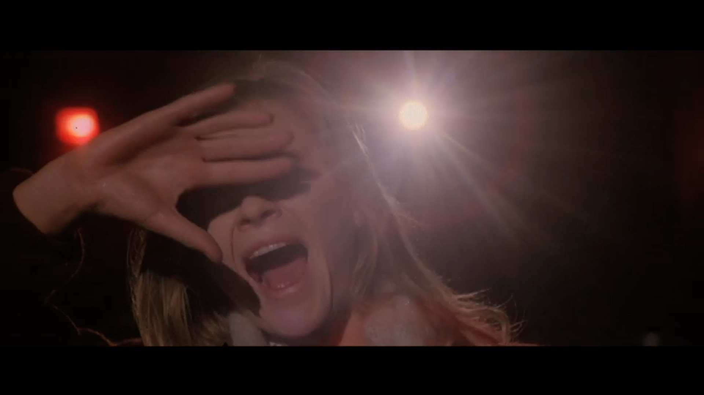

The New York Ripper has been one of the most challenging films I've watched in recent times. It's violence and sexuality are off the charts -- all in all a cracking [Giallo](https://davidpeach.co.uk/tag/giallo/) thriller.

New York is being terrorised by a serial killer who seems hell-bent on cutting up young women, seemingly for some kind of sadistic sexual pleasure. And these acts of violence are put front and centre in your face. Every. Single. Time.

The opening credits consisted only of the still image of the dog with the severed hand in his mouth that he's just found in a bush. With this and the funky 70s television flavour soundtrack, it felt almost like a black comedy of sorts.

I don't know why I kept getting the vibes of a black comedy in this film. Perhaps it is the super over-the-top depictions of killing and the fact that the killer pretended to be a duck whilst murdering people.

Screaming

## Quack quack quack

Ducks... Yer... So, the killer begins quacking like a duck as they begin violently cutting open their victims. Stay with me though. At first it was kind of funny and a complete juxtaposition to what was going on on-screen.

But as the film went on, that sound became bloody terrifying to me. Like a razor sharp shriek cutting straight into my brain. Walking down the canal feeding the ducks with my lady will never be the same again...

I liked how there is actually a reason for that duck sound too (no -- the killer is not a duck) and it is actually more of a grounded reason than I was thinking it would be.

And when it comes to the identity of the killer, I found myself guessing right up until the point at which one of the characters clocked it. Yes I am a bit slow, but I think that Fulci did a great job at dropping red herrings here and there.

## Beauty in the killing

Only after I wrote that heading did I realise how mental it sounds. Oh well, it's staying. haha.

I don't often find any sort of pleasure out of people being killed in films -- unless they have it coming of course -- but I can appreciate a really stunning piece of cinematography from the violence. And this film has those throughout -- and not always in relation to a death scene.

Despite many of the scenes being so graphic -- in both sex and violence -- the director, Lucio Fulci, has created some incredible-looking sequences throughout his film, that just beg to be looked at again and again.

The way in which he uses colour alone is incredible -- most notably a scene with live sex performer Eva, as she is returning to her dressing room.

I loved this section so much that I have included five none-spoiler screenshots of it here:

Eva heads back to her dressing room

Eva shuts the door behind her

Eva in her dressing room

Taking the fake lashes off

Broken glass

Some shots of the scene with Eva in her dressing room -- possibly one of my favourite scenes from a Giallo film so far.

Eva's scene reminded me of [Alfred Hitchcock's Vertigo](https://en.wikipedia.org/wiki/Vertigo_%28film%29). Specifically a hotel room scene in which a character is bathed in the neon green light of the hotel sign outside the window. This isn't the first time I am reminded of Hitchcock's work in a Giallo film either.

Some of the scenes in New York Ripper reminded me heavily of a more modern film I've seen too -- [The Neon Demon](https://davidpeach.co.uk/2017/10/02/thoughts-on-the-film-neon-demon/). No doubt the director of that film, [Nicolas Winding Refn](https://en.wikipedia.org/wiki/Nicolas_Winding_Refn), took heavy inspiration from the Giallo genre -- something I am only just uncovering for myself in my new obsession.

This scene from Fay's train ride had some great set pieces in it too. The train itself and shortly after, the cinema:

Fay rides the train

## Conclusion

If you are feint of heart please **do not watch The New York Ripper**. It uses extreme close-ups of killings like my partner uses Ketchup: in large doses.

However, if you dig over-the-top violent scenes with elements of beauty in films, then this could be right up your street.

Despite my constant mention of violence and sex in this film, it does have a good story. A story quite typical in the world of slasher / giallo films I think: detective tries to track down violent serial killer as more killings unfold in more beautiful and dramatic ways.

And although it shares so many Giallo characteristics, it is uniquely memorable in so many ways.

Jane Lodge is a very sexual woman

The ripper takes their first victim

At the end of the corridor
