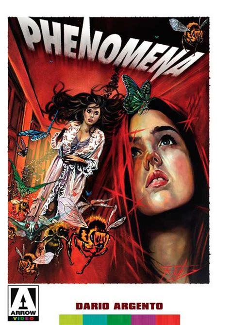
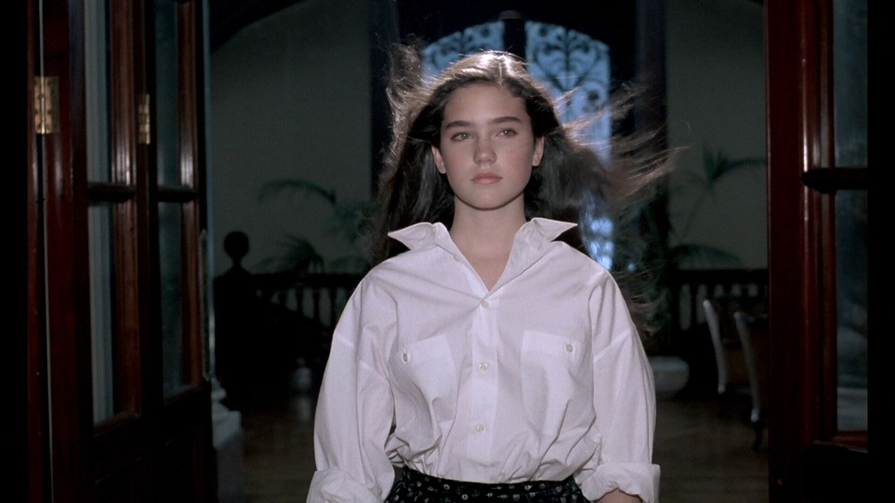
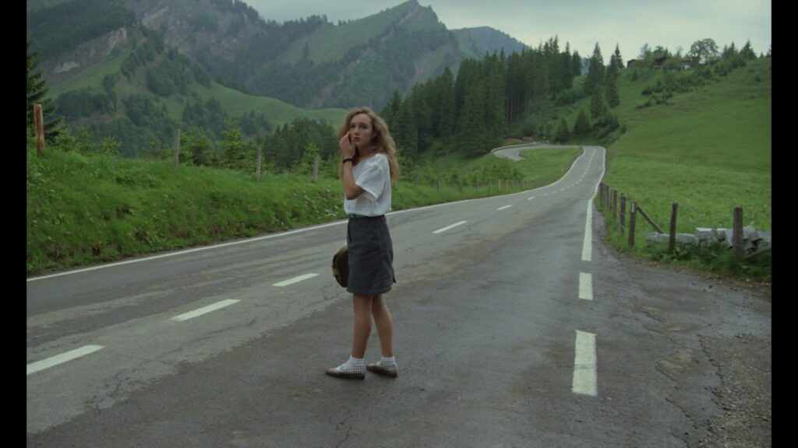
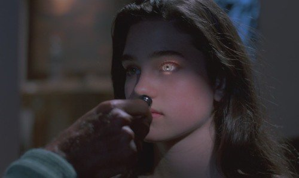
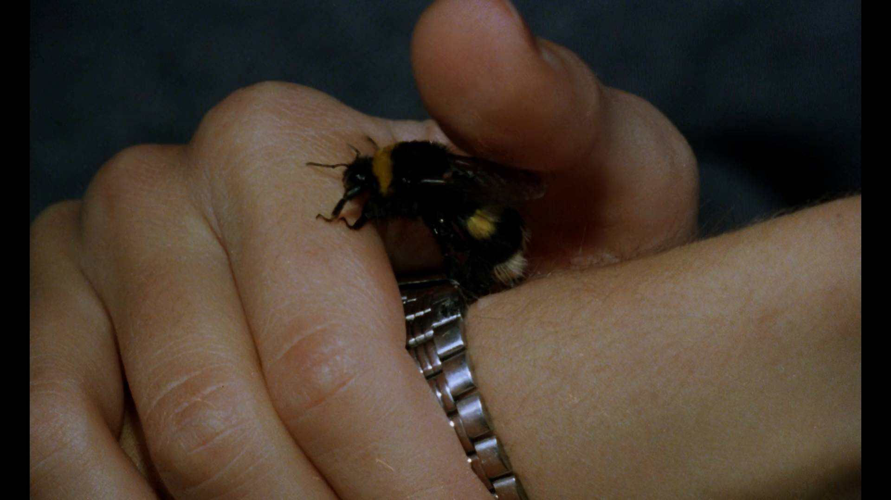
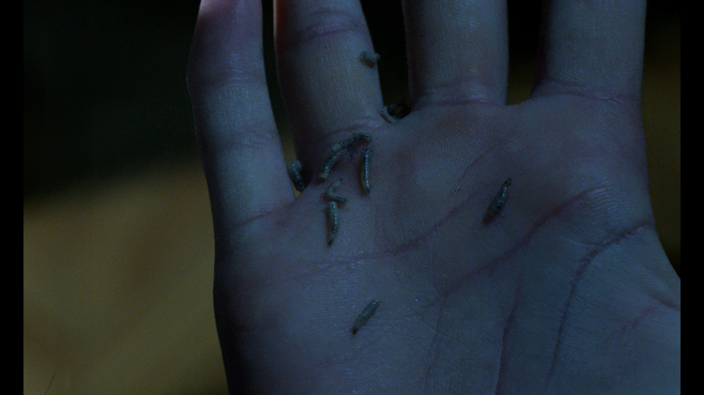
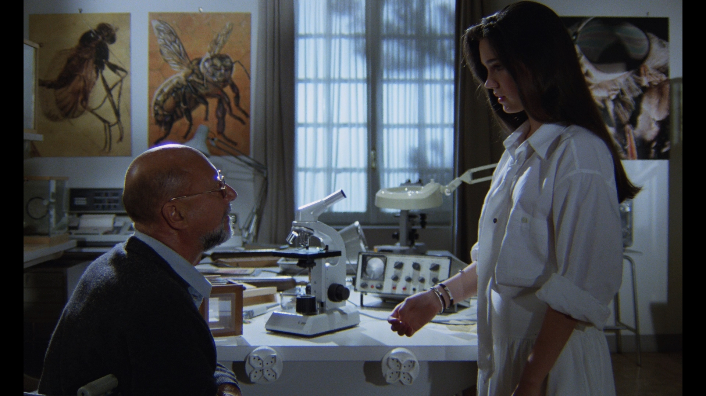
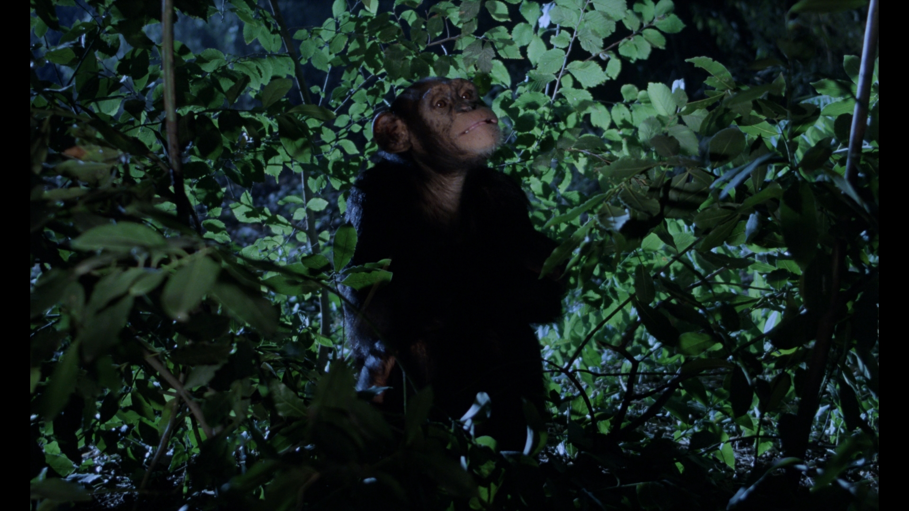

The next film in my Giallo journey was Dario Argento's Phenomena -- arguably one of his best. Although, to be fair, I haven't seen a bad Argento film yet.

From it's wide open start amongst the Swiss countryside -- where a student girl misses her bus -- to the claustrophopic, insane ending, this film had me hooked and anxious throughout.

I thought that with [Jennifer Connelly](https://en.wikipedia.org/wiki/Jennifer_Connelly) as the main star, along side [Donald Pleasence](https://en.wikipedia.org/wiki/Donald_Pleasence), I would feel relatively safer than I have with previous GIallo films. I knew her mainly for the film she did the year following Phenomena: The Labyrinth. But how wrong I was.

## Phenomena -- synopsis

The film is about a young girl, Jennifer, who is sent to a Swiss girls school by her father. She already knew that she had an affinity with insects, but it is during her short stay at this school where her affinity grows stronger and stronger.

In the area there is a serial killer who seems to be picking off the girls from the school. And after Jennifer witnesses something she shouldn't have whilst sleep walking, she fears that she is next.

In her travels she meets a local scientist -- one who specialises in insects (very apt) -- who she teams up with to try and track down this killer on the loose.

## The Soundtrack

Phenomena's soundtrack was partly done by [Goblin](https://en.wikipedia.org/wiki/Goblin_(band)), as with other films of Argentos'. And it is as awesome as you can imagine, (if you've seen films like [Deep Red](https://en.wikipedia.org/wiki/Deep_Red) or [Suspiria](https://en.wikipedia.org/wiki/Suspiria) before). If you haven't, then you are in for a real treat in experimental music.

Joining Goblin, and some others, on this kick-ass soundtrack, is none other than Iron Maiden. Namely the song "Flash of the Blade" from their 1984 album "Powerslave". One of my favourite Iron Maiden albums, and the first album of theirs that I bought coincidentally.

The soundtrack does wonders for this film's pacing. At one point I was anxious and nervous following these characters. But then when that crazy opening to "Flash of the Blade" came on, a huge smile took over my face. I found myself simultaneously foot-tapping to a great song i'd forgotten about, and worried for a woman's life as she ran from a merciless killer.

Jennifer from Phenomena

## Reminiscent of Hitchcock

[Alfred Hitchcock](https://en.wikipedia.org/wiki/Alfred_Hitchcock) is a huge influence on so many film makers, especially the ones worth their salt in my opinion. Some directors make this more obvious than others in some of their films (and I don't mean that negatively). One good example that springs to mind is the look and feel of [Martin Scorsese's Cape Fear](https://en.wikipedia.org/wiki/Cape_Fear_(1991_film)). I remember feeling that if Hitchcock was alive and made that film, it would be very similar aesthetically\*. This was aided in no small way by employing Hitchcocks long-standing music maestro [Bernard Herrmann](https://en.wikipedia.org/wiki/Bernard_Herrmann).

\*Disclaimer: I'm not a film student so am probably talking absolute crap :D

Anyway, there is a scene in Phenomena where Jennifer is trying to track down the killers hideout using a very unconventional method -- I'll let you discover the method. But method aside, the entire bus ride she takes from the town centre out to the rolling swiss countryside hills was a complete callback for me to [Torn Curtain](https://en.wikipedia.org/wiki/Torn_Curtain) -- Hitchcock's lesser-known, but no less incredible, political thriller film from 1966.

Vera Brandt misses her bus

## In Summary

This feels like the most accessible of Argento's films I've watched up till this point. I mean, they have all been on Amazon Prime, but due to the use of more western actors who I'd known from previous films, this film felt that bit more familiar to me. Of course this is only from my own perspective. Also I often prefer not knowing any actors in these Giallo films -- it somehow makes them feel more dangerous.

That said, I thoroughly enjoyed Phenomena for every single moment of its almost-two-hour run time. One thing I'm noticing from Argento is that I am finding myself remembering so much from his films -- due to so many of his scenes feeling so iconic.

The violent pane-smashing opening, the unconventional vat of... stuff, and of course _that scene_ with the chimpanzee (spoiler: the chimpanzee survives this crazy story\*\*).

\*\*If I thought a Chimpanzee was going to be killed I probably wouldn't watch it, so wanted to put your mind at ease there. :)

## Some stills from Phenomena

Jennifer is examined

Jennifer strokes a bee

Maggots are a strong theme

Jennifer and Professor McGregor

Inga the Chimpanzee
