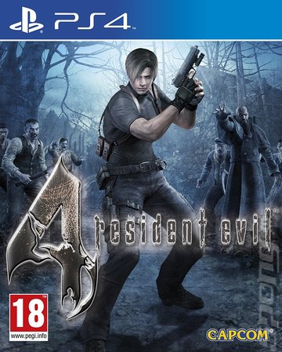
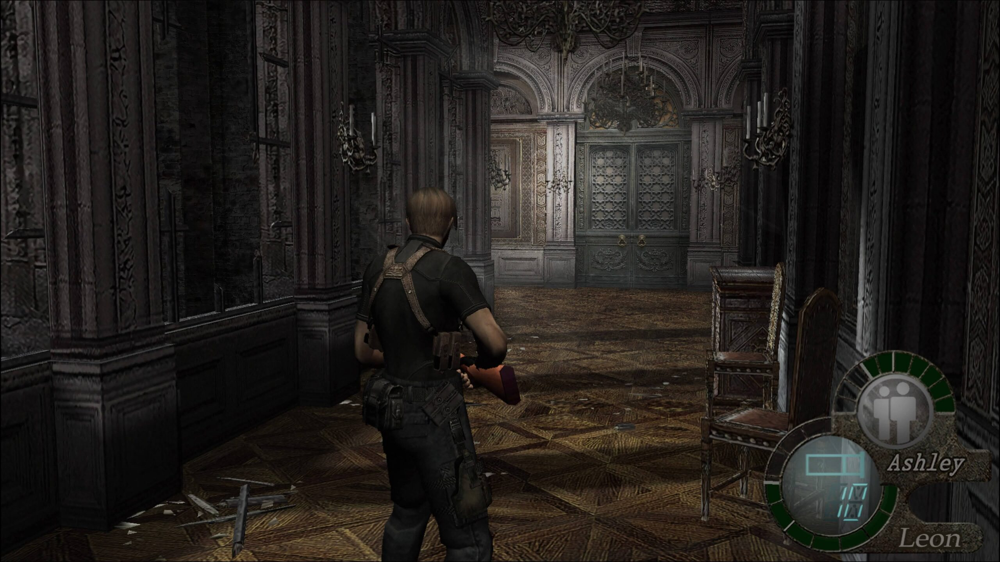
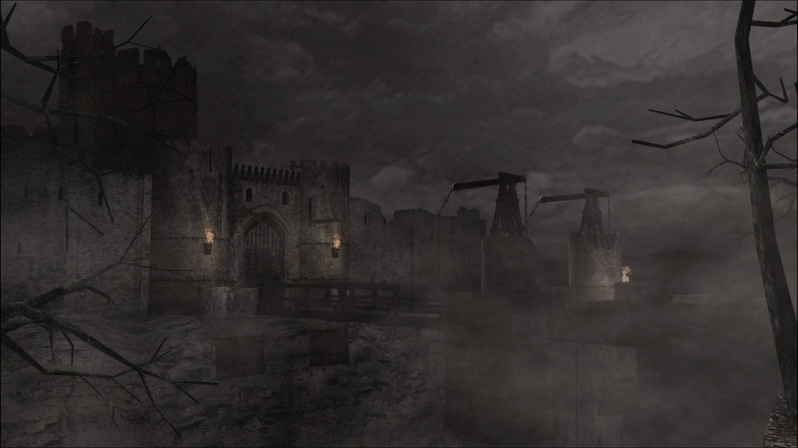
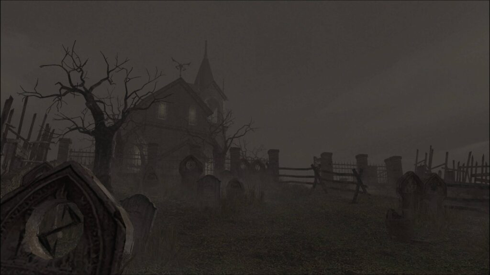
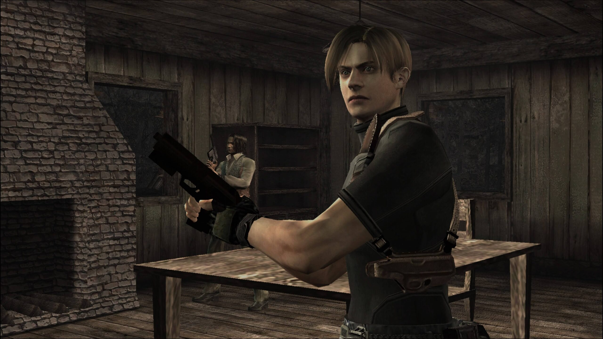

It's felt like the longest time to get into the swing of things with Resident Evil 4.

When I first tried it about four or so months ago, I didn't get the appeal - at least not now in a post - RE2 Remake world. After my first failure and struggling with the control system I didn't think I'd ever go back.

But I did go back -- months later -- and I am so so glad I did.

Resident Evil 4 has become a favourite of mine. I would put it alongside RE2 Remake in terms of enjoyment and replayability.

## The Controls

The control system felt entirely foreign to me on that first play months before. I went into it expecting similar fluid controls of the recent RE remakes, but instead was greeted by something half way between that and the old tank controls of the originals.

The aiming felt so constricted -- having to stop running, begin aiming, and then slowly move the gun's reticle to where I needed to shoot.

However, after an hour or so of playing something happened -- I noticed that I was just moving along and playing the game. I was no longer forcing anything.

What I first thought to be constricting was in fact what was helping to give tension to the game play. The fact I couldn't walk and shoot meant I had to choose my moves more wisely.

The Castle Corridors

## The Setting

The Eastern European setting is absolutely gorgeous. And the excellent soundtrack really helps tie the whole thing together.

The game never lost its claustrophobic feel for me either. Despite the early parts of the game being in relatively more open surroundings, the levels are designed in a way that leaves many corners to be surprised from. There were many times when I would hear a shuffling noise and not be able to fully pin point it.

Later on, the setting takes on a more Gothic tone in a huge, decadent castle -- before leading you to it's final location, which I'll leave you to discover. The castle is a really stunning level and some great, sometimes over the top, moments in it.

I especially enjoyed a no-combat section where you have to control Ashley to get her to Leon safely. Some truly spooky moments in that little section.

Overall, the game was much longer than I was expecting. Just as I thought it was moving towards a resolution a whole new chapter would begin. Despite the 16 or so hours of play time I spent, the experience felt so much longer -- and I mean that in a good way.

Approaching the Castle

## The Enemies

The game really throws you in at the slightly deeper end. I thought I would never get past the first village encounter -- it felt impossible with just too many enemies coming at me at once. But after persevering and reaching the end of the first chapter, it felt like it was all coming together.

The early part of the game sees Leon fighting off the village's residents who have all become victim to a mind-controlling parasite. Controlled by some unseen entity they run at you before slowing to a walk just a few metres away. This gives you that time to aim the weapon and fire -- so they don't just all run at your face at once.

Later on you'll meet creepy cultists and flying bugs, before working your way through the game's hierarchy of main villains.

There was one enemy type in particular that was equal parts inventive and terrifying. But I'll leave you to discover those for yourself, should you dare to play. :P

The Church and the Graveyard

## In Summary

Resident Evil 4 went from being a game I couldn't stand -- just down to it's controls -- to one I couldn't do without now. After getting past the initial confusion over the half-tank/half-fluid control system, it really is a blast to play.

The village and Gothic setting make me even more excited for the upcoming PS5 "Resident Evil 8 (Village)". Taking what they learnt and developed with RE7 and applying it to this kind of Gothic setting, Capcom could be making something really special to experience.

I can't recommend RE4 enough. For it's crazy story, hideous and tough monsters and often cheesy dialogue.

Leon needs you.

resident evil 4\_20200831062445
