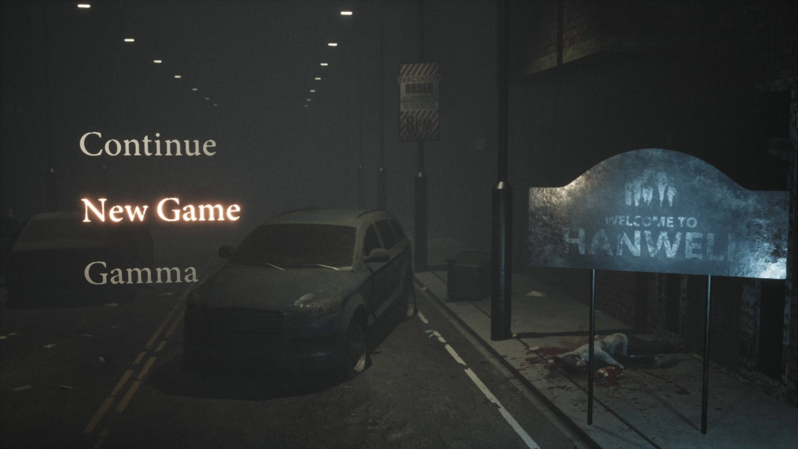
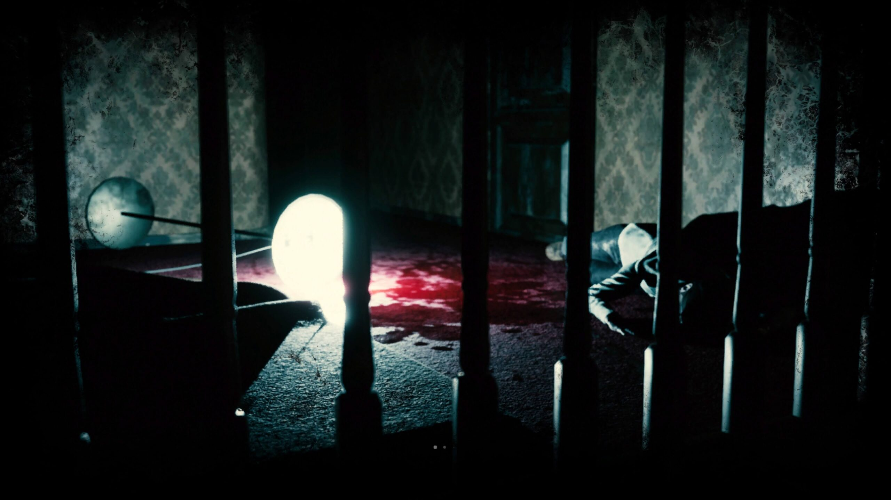
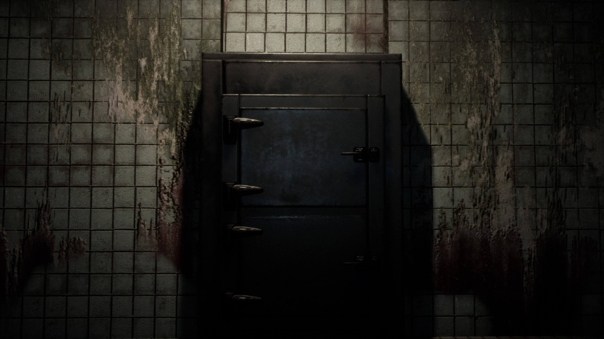
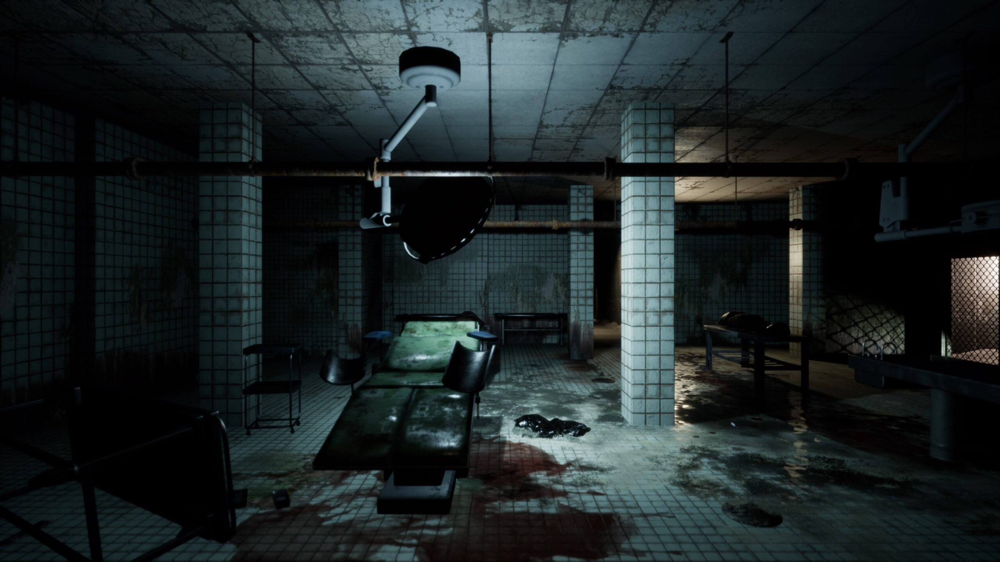
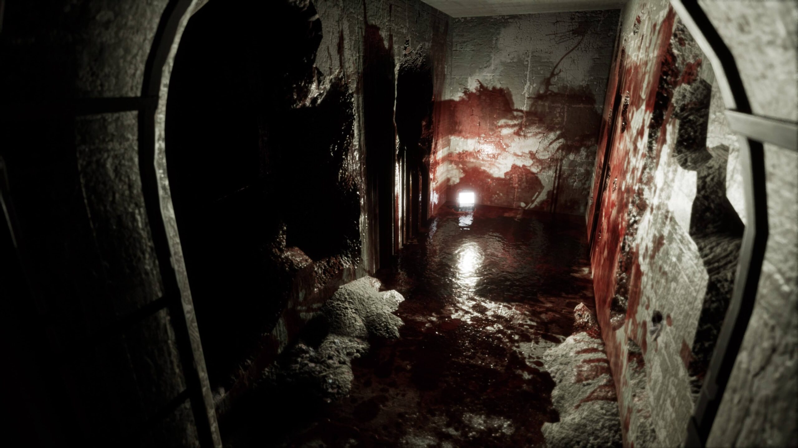

I picked up Welcome to Hanwell for a few quid in a recent PlayStation Store sale. On first playing it has a good creep factor. Waking up in a morgue and taking your first steps in the dark, dank blood-splattered underground is a great introduction to any horror game.

The opening had me walking through a couple of corridors into the adjoining rooms and office, as it taught me the basic game controls and mechanics. One of these mechanics was looking behind you as you run -- this can only mean bad things ahead.

I love the atmosphere of the game so far -- despite having been unable to escape this basement area for about 45 minutes or so. The idea of an open-world horror game does tickle my fancy somewhat, so I really hope I can get past this first challenge.

And no -- I'm not going to spoil what that challenge is. :D

Welcome to Hanwell\_20200913110103

Welcome to Hanwell\_20200913110109

Welcome to Hanwell\_20200913110127

Welcome to Hanwell\_20200913110157

Welcome to Hanwell\_20200913110603

## One draw back for me

I have to mention one thing that has me a bit miffed. I can not find any option to invert the Y axis. :( . This may seem like a petty thing, but I find it super jaring to play any game without the inverted Y axis. I think this can only be due to the many many hours I spent playing Ace Combat 2 on the PlayStation as a youth.

I have tweeted the developers in the hope that it could perhaps get added in an update. Not sure if this will happen, but if you don't ask you don't get.
