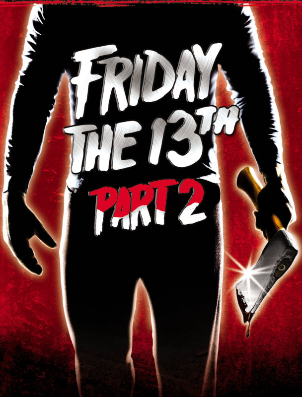

The second film in the Friday the 13th series and first appearance of Jason.

I absolutely loved this film.

I found myself constantly second guessing what was going to happen next.

Apart from being an entertaining and very 80's killing spree around the cursed area surrounding Camp Crystal Lake, I thought this was a really well made, and clever horror film.

The opening scene was, for the lack of a better word, perfect. The sustained tension through the entire five to ten minute opening with the first film's lone survivor almost gave me a stomach muscle ache i think.

The camera direction was incredible in pointing my attention to places I was certain someone would appear from. Even the shower room POV shot -- done _Psycho_ style -- ending in the lady all but winking to the camera to say to the audience "I know what you were thinking", had me smiling to myself.

Smiling and nerve-wracked all the way to the opening scene's superb climax.

One of the best opening scenes in a horror film I can remember seeing.

* * *

The rest of the film was great from beginning to end too, with some great moments of tension throughout.

There was even one particular death that I found myself second guessing again too. I wont say which, but after what I'd consider clever uses of misdirection up until now, I found myself assuming that a certain scene was going to be more drawn out and elaborate than it was.

When in fact it couldn't have been more straight forward and to the point. #BladeToTheFace

As far as the killings go, this wasn't as gory as I was expecting it to be. I think that maybe as this series is one of the bedrocks of slasher films, it has a level of infamy that can easily hype it up in the minds of those that haven't yet seen it. Despite my saying that, I think that the level of violence in general will keep any horror fan salivating.

One thing that did surprise me was that Jason felt much more human than I was expecting. In all of the references I had seen to him up till now, he is portrayed almost like a machine that can not be killed. Although saying that, there was an awesome scene as he is revealed in full for the first time -- where he stands up from under a cover, towering over his next victim.

A really imposing figure and one of my favourite scenes of the film.

His ability to get back up after certain injuries seemed almost plausible here too. However, I am fully expecting his recoveries to get less and less plausible as I delve deeper into this series.

* * *

I had to smile and grimace at times when either a couple would have sex or someone would say "I'll be right back" -- I was immediately reminded of a key scene from Wes Craven's Scream, where a horror film nerd would describe these dangers and things to not do in a horror film. It seems that he was right.

I had already enjoyed the first Friday the 13th film some time ago. And now that I have enjoyed this one even more, I am really looking forward to getting further into Jason's world.

Despite my expecting them to start degrading with originality over time, from what I've heard at least, I am really excited to be going on the ride for the first time.
