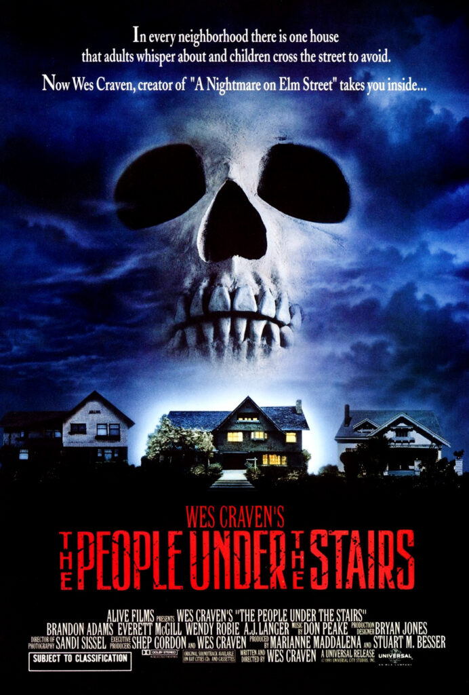

I finally faced my childhood trauma by watching The people under the stairs in full. I saw sections of it as a child and remember only the image of children running from something in the wall cavities of a old creepy house.

It was an absolute surprise and joy to see Everett McGill and Wendy Robie as an on-screen couple again after their iconic partnership in David Lynch's Twin Peaks as Ed and Nadine Hurley.

Credited as simply 'Man' and 'Woman' respectively, the pair live in a large fortified house just outside of a Los Angeles Ghetto. That Ghetto is pretty much owned in full by the couple -- land and property bought and passed on through the years to subsequent generations of the family.

The couple are Land lords to many in the neighbourhood, but specifically a family struggling to pay the bills due to abject poverty and family illness. The story kicks off when the poor family's young son, nicknamed 'Fool', is used by a criminal friend of the family to help break into the rich couple's house. They do this to try and find a rumoured collection of gold coins that have been hoarded there.

What follows is them all trapped in the house with no escape, running and hiding from the sadistic couple armed to the teeth and commanding a large, vicious dog. Not only that, but they must also content with the people under the stairs.

* * *

The things I found most scary this time around were not necessarily the chases through the walls or the basement encounters, although they were often tense. What I found myself finding most horrific was how these crazed parents treated their daughter Alice.

Alice lives under a constant cloud of threatened, and often enacted, abuse. Later we even see her slammed on to the floor to clean the blood-drenched wooden flooring of the house. And then soon after being force-cleaned by her mother in a visibly-scolding deep bath of water.

How this film went from comedic moments of joy to horrific moments of torture and mutilation was all but expertly done. Despite having so much to offer in terms of tone, it never felt jarring. It was a roller coaster that just kept throwing in loop-da-loops and sharp left turns.

* * *

Mcgill and Robie were incredible as the crazed couple hunting for the blood of the intruders whilst trying to keep their current captives under control. And then there is the illusive thing living in their walls.

Oh, and their dog is bloody terrifying.

I loved them both in Twin Peaks. The people under the stairs made me love them even more.

Equally as impressive was the actor playing Fool -- Brandon Adams. He had great charisma on screen and his character really kicked ass and held his own against the lunatics.

Fool would often fight back against his pursuers and never made any dumb decisions to merely serve the plot.

He sure is one smart cookie.

* * *

I'm actually proud of myself for clocking the satirical take on the nature of capitalism throughout the film too. Maybe all of this writing and thinking a bit more about the films I watch is having an affect on me?

I enjoyed this film so much, and for many different reasons. I really can't recommend it enough.
