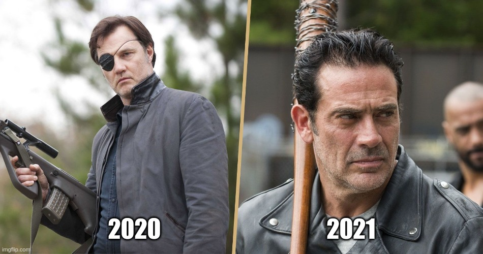

Disclaimer -- this post is still in a bit of a draft state. I have published it, however, as it is New Year's Eve 2020 and if I don't do it now I will probably forget to do it.

What an absolute bloody shit show this year has been. I’ve been super lucky when compared with most and still it’s probably been the most terrible year I’ve experienced.

Inept and corrupt Government; complete idiots who think wearing safety masks are against their civil liberties and more besides.

I thought I’d start a new tradition of reviewing the year just passed and looking towards a plan for the new year to come.

## Work

I began this year working at a Birmingham based web agency called **Substrakt**. And although I enjoyed most aspects of the work, and 100% of the people, the job just didn’t end up being the right one for me.

From there I moved to another Birmingham based agency, **Eastside Co** -- this time focusing on the Shopify platform. And despite having a great welcome and on-boarding, have decided that Shopify is not a platform I want to be focusing my time and energy.

At the time of writing I have recently handed in my notice and am planning to start at a new company come February time. Really looking forward to seeing what the future brings there.

## Music I've discovered

I have fallen in love with an American metal band called **Skid Row** -- more specifically their excellent album "Slave to the Grind".

I have learnt to actually enjoy a couple of songs by **The Killers**. The two songs I have come to love are "The Man" and "Shot at the Night".

Eminem's album "**Music to be Murdered by**" is incredible and the recently-released Side B album is growing on me too.

The music of **Low Roar** was an obsession of mine thanks to the excellent PS4 game "**Death Stranding**". My obsession was compounded when I was working at Substrakt as I would have to take my work laptop to and from work in a large laptop / travel backpack.

> Sam, sam - He's our man
> 
> Sam Porter Bridges from Death Stranding

## Books I’ve read

This year I planned to read 12 books -- 1 per month. However, I failed miserably and only manage a few.

I kicked off the year with George Orwell's **Animal Farm**.

Next came my trying to read Dune, but stopped reading part way through. Not sure why if I'm honest.

I also tried to read Stephen King's It, but I just couldn't get my head around the shifting character points of view in a police interrogation scene near the start. Need to re-try that one.

I read a classic horror book this year -- Bram Stoker's **Dracula**. And I loved it. I read it because it felt like it was one of those bedrocks of horror that I should read in my life. I'm glad to say that I really got lost in that one. I definitely plan to read it again soon.

I have just (literally 1 hour before writing this) finished Stephen King's **Duma Key**. One of the longest books Ive attempted, only surpassed by Clive Barker's Gallilee some years ago. I really enjoyed the journey and characters of Duma Key but couldn't help but feel slightly disappointed by the closing chapters. To be honest I don't think "disappointed" is fair to say. I think it was more like me just expecting a huge explosive ending, when in fact the ending was more low key. But I can't really fault the book as a whole -- it was a journey I enjoyed being taken on.

## Films I've watched

I have been digging into **Italian Giallo films** more this year and even got round to watching the remake of **Suspiria**. Absolutely insane and incredible in equal measure.

I finally began watching the **Friday the 13th film series** (only the first 2 so far). Loved part 2 and looking forward to continuing this journey soon.

I really need to be making a note of the films I watch next year too. As I can only remember the ones I've written about on my site.

**The New York Ripper** and **Rosemary's Baby** were stand out films for me that I discovered in 2020.

## Games I’ve played

I have come to the decision that **Horizon Zero Dawn** is my favourite game of all time -- at least until Forbidden West comes out. I finally played through the story of The **Frozen Wilds DLC** and found to be a glorious addition to an already perfect game. At least perfect in my eyes. I really must write up a post about that game.

Before the DLC, I conquered the game on Ultra Hard New Game plus, and really would have the game any other way. I am still working on getting 100% completion for it and its DLC content.

**The Last of Us part 2** was the stand-out new release for me this year. And despite having to big twist spoiled accidentally the night before release -- yes I managed to not hear anything up until then -- I still enjoyed it for the dark, brutal, often tough-to-endure story that it is.

I have replayed **Death Stranding** and took my time, almost doubling the play time from my first play through.

## I made a meme

2020's Governor to 2021's Negan -- A Walking Dead meme I made

## Next Year

Like many people I have some goals for the coming year. I want to buy my own home with my lady. I want to be move organised and more goal focused, which I've actually been working on in the latter part of this December 2020. I should thank Carl Pullein for this organisation boost as I am implementing his TIme / Sector system -- it seems to be working for me so far.

I want to read at least 12 books this year. I have written out the 12 I want to read and in which months. Only this time I am determined to actually pull through with it. I am starting on January 1st with Daphne Du Maurier's **The House on the Strand**.

I will be dedicating more time to building up my [Junji Ito Manga site](https://junjiitomanga.com). Writing a lot more on there and building out the tag pages too.

Along with writing the posts on the Junji Ito site, I will be aiming to write a lot more heavily on _this_ site also. As well as keeping better track of what I watch, read, hear and play.

I want to see many more Films this year too -- specifically classic horror.
