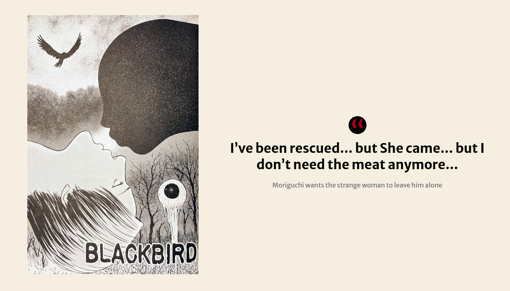
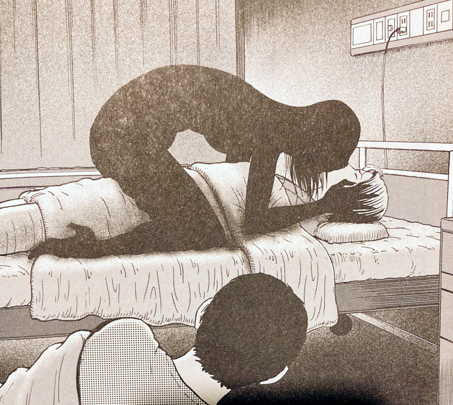
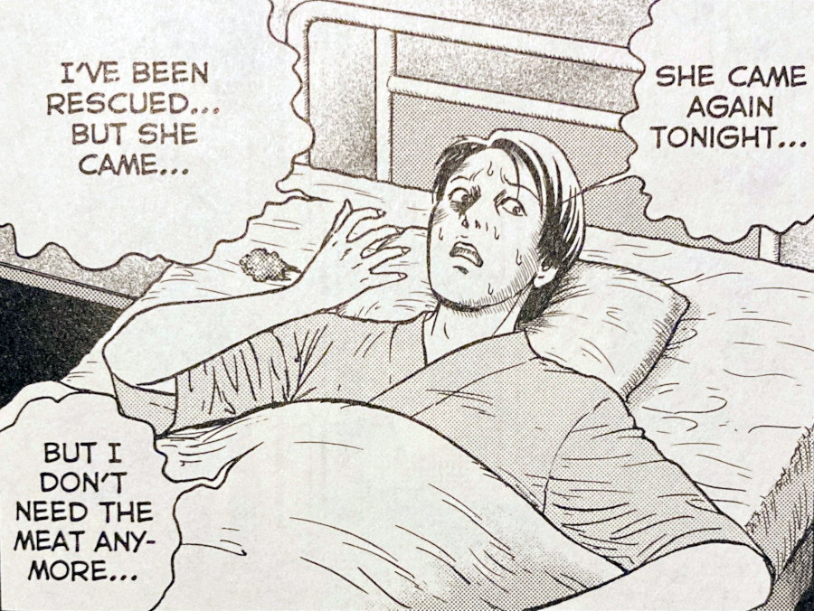
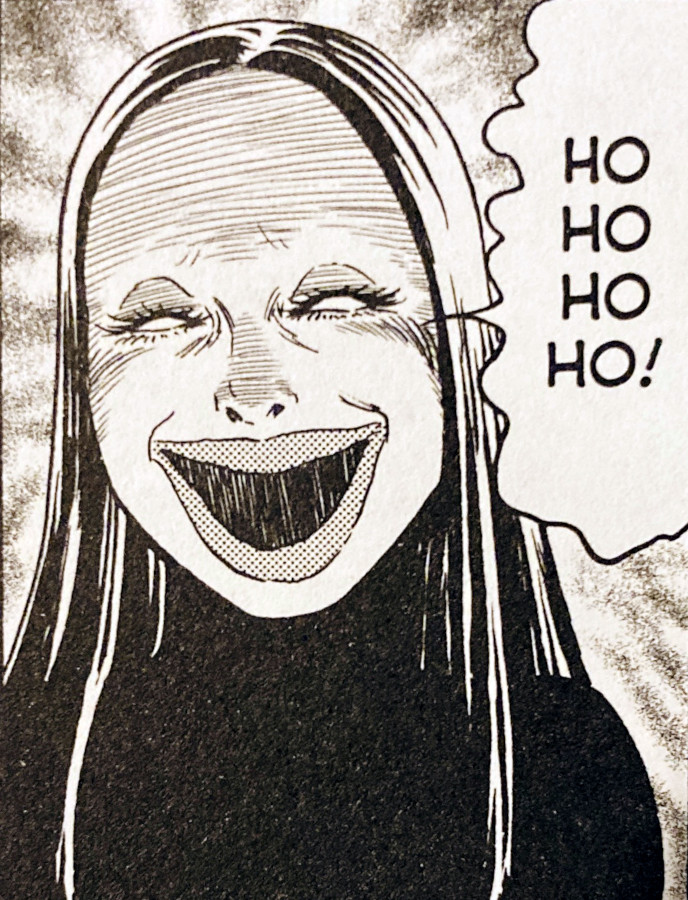

> I've been rescued... but She came... but I don't need the meat anymore...
> 
> Moriguchi wants the strange woman to leave him alone

## Blackbird -- Synopsis

In Blackbird, we join a young man who is bird-watching alone along a beautiful stretch of a mountainous forest. This man's name is Kume. Along his walk he comes across another young man who is lying injured amongst the foliage -- his name, Moriguchi. It seems that Moriguchi has broken his leg, and has managed to survive for a month or so on nothing but the rationed food from his own backpack.

However, as the story continues we learn the deeper, darker truth to Moriguchi's survival. On the first night of his rescue, he asks his new friend Kume to stay in the hospital room with him. He doesn't give a specific reason, only that he is scared. That fear is soon realised by Kume during the night, when he witnesses a long black silhouette of a figure kneeling over Moriguchi with its face pressed against his.

On a closer look, Hume sees that the figure is a tall woman with empty, dead eyes and puffed-up lips. After she has made her swift exit, Moriguchi wakes and coughs up a huge chunk of raw flesh. The raw flesh having been fed to him from the mysterious woman's mouth to his; bird-style.

Just who, or what, is this woman who has been helping, and still _continues_ to help, Moriguchi in this very odd, stomach-turning way? Why did she choose to help him as he lay injured on that forest floor for a month? And will he ever be able to escape her shadow and her bird-like ways?

## A Faustian-like nightmare

This story had the air of a [faustian](https://en.wikipedia.org/wiki/Faust) tale for me. A sort of "[deal with the devil](https://en.wikipedia.org/wiki/Deal_with_the_Devil)" in exchange for something that must be later re-paid. Re-paid with one's soul and eternal damnation.

The only difference here between The Blackbird and the more classical faust-inspired stories, is that Moriguchi seems to make this deal subconsciously during his fear for his life. As opposed to the more well-off people of a classical faust story; People who just want more knowledge and / or power.

At least this is my interpretation.

His own fear for losing his life could have somehow summoned this woman -- this devil. The woman then taking him into a strange, almost recursive, nightmare from which he can never escape. But it's only on finishing the story do you realise just how sealed Moriguchi's fate really is.

After we discover that it is in fact his own flesh, somehow from his future, that is being fed to him, I realised that this was a deal that had already been claimed. Yes, she saved him from certain death, but it was from the meat of his own body.

So in essence he saved himself in that immediate moment, but at the expense of his future self.

Moriguchi's death was always inevitable.

A shadow looms over Moriguchi

## An interpretation of Death

Another interpretation I thought about with regards to the bird lady, was that she could be another manifestation of the [Grim Reaper](https://en.wikipedia.org/wiki/Death_(personification)); Death incarnate.

The inevitability of death is equal for all living creatures. No matter when or how that time comes, it is something that we all share. So when this woman entered Moriguchi's life and took him into her twisted nightmare, she did so knowing full well that she would take his life in the future.

In fact, from her point of view she had already begun.

When you think about it, Moriguchi was already about to face death, regardless of the woman appearing. So in fact, she actually gave him more time on the living earth.

Is the demonic winged lady truly an evil being? Could she even be responsible for Moriguchi's initial state of injury? Or could she actually be something of an agent for good?

Here's a thought -- what if she was some sort of angel, with the power of life and death. What if she was actually trying to give Moriguchi a bit more time in the world?

Perhaps she knew that when death decides it is our time, then it is indeed our time. But maybe she had the power to prolong that person's life, if only for a short while. But in doing so knew that the life in question was already chosen and must inevitably be claimed.

Moriguchi's fear for the woman's return

The strange woman has empty dead eyes

## In Summary

The Blackbird was one of the first of Junji Ito's stories I remember reading. It was one of the ones contained in the first of his collections that I bought -- [Fragments of Horror](https://junjiitomanga.com/tag/fragments-of-horror/). And despite the fact that I have read a decent portion of his work up till this point, it still remains one of my favourites to go back to.

It's a circular nightmare that I love to re-enter again and again. The imagery of the blackbird woman leaning into Moriguchi on the hospital bed is one of my favourites of Ito's. Although the panel itself isn't hugely detailed -- especially the woman herself, being only a silhouette to Kume's eyes -- I just remember the sense of wonder I got on my first reading.

Being fresh to Ito's work at the time it was something that really opened my eyes to his work and was one of the main catalysts in my wanting to actually write about that work. Too bad it's taken a few years to actually get round to writing about this one.

Fragments of Horror is an incredible smaller collection of stories and I fully encourage you to take a look -- if only to read the awesome story that is Blackbird.
