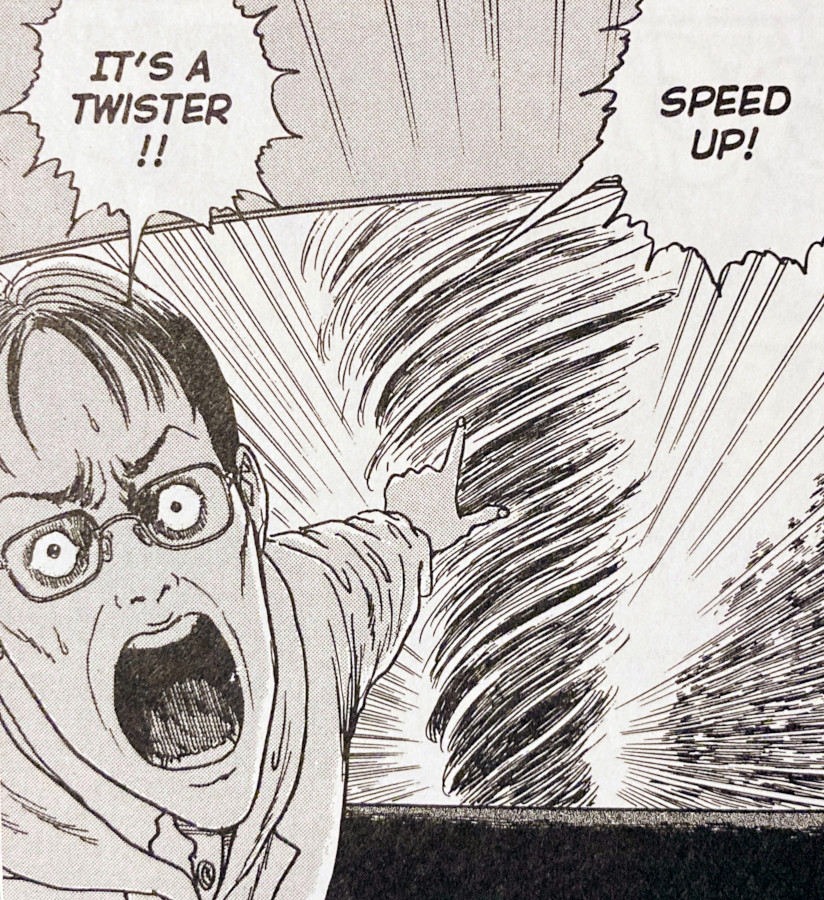
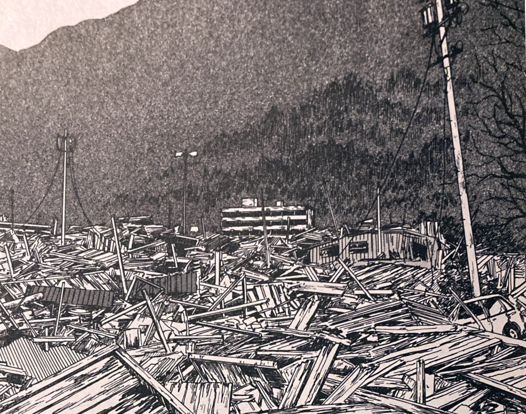
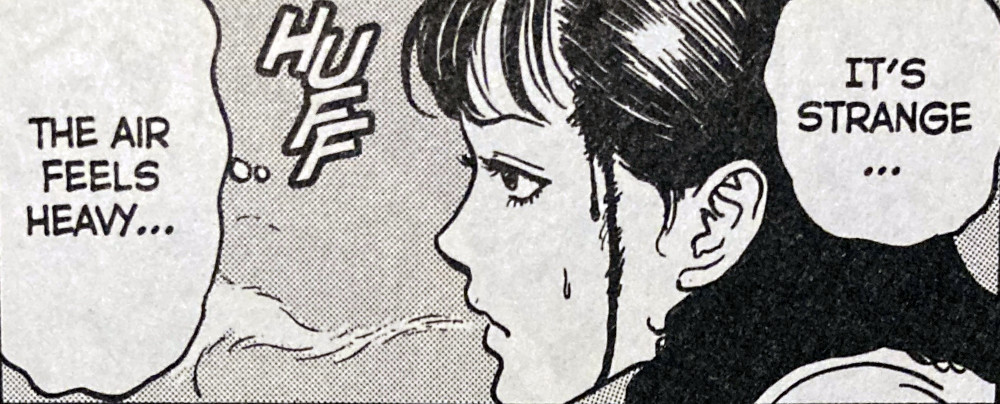
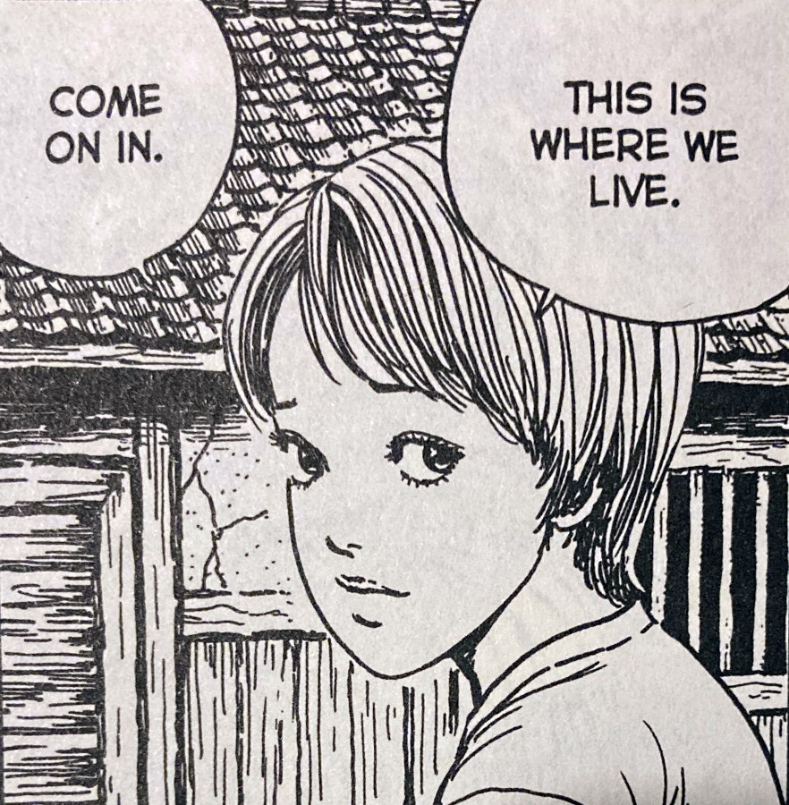
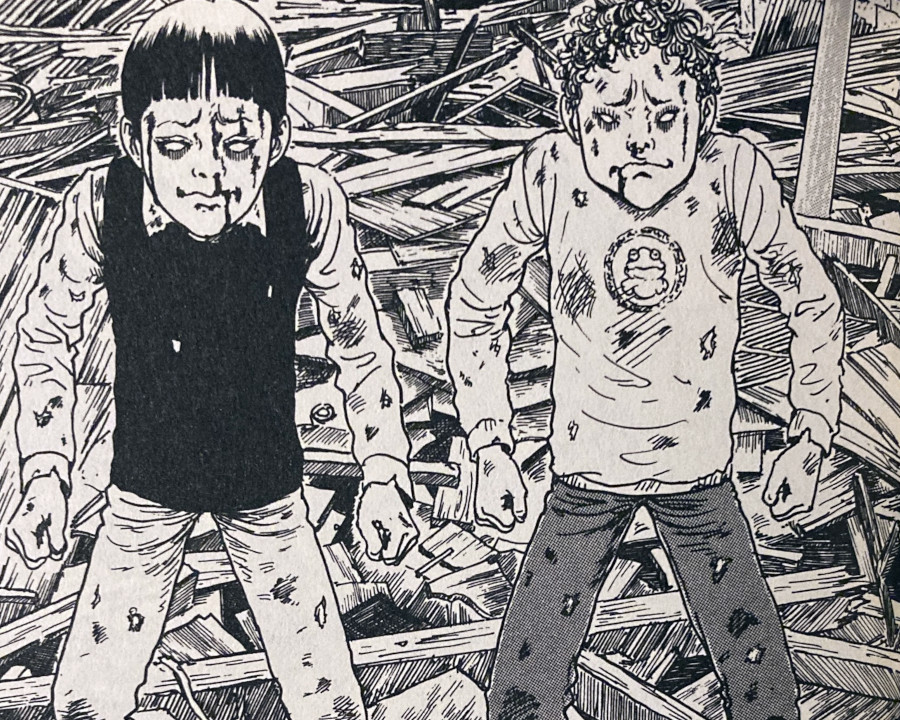

> The flapping of a single butterfly's wings can create a hurricane on the other side of the world. That's what's happening in this town.
> 
> Chie Maruyama describes the "Butterfly Effect" to Kirie.

## Butterflies -- Synopsis

Butterflies is the continuation of the story of [Uzumaki](https://junjiitomanga.com/tag/uzumaki/). It follows on some time after the shocking events of [The House](https://junjiitomanga.com/the-house-uzumaki-part-13/) -- after an unknown period of time. We begin by following the car journey of a set of new characters -- a news crew sent to Kurouzu-cho. We learn from their discussion that a number of further hurricanes have passed over the town. So we know at least a bit of time has occurred between chapters.

On entering the outer limits of the town, the news crew's car is flipped by a small whirlwind -- a "twister" -- that seemed to have come from out of nowhere.

From out of the car wreckage only the lady is able to stand -- the two men are left unconscious in the car. She quickly heads off into the town to try and find help. What she finds, however, is the once-picturesque town of Kurouzu-cho now mostly decimated by hurricanes.

The place is no longer fit to live in.

During her search she comes across three young boys that have been tied up to large posts -- their mouths covered. Her first instinct of course is to help the boys out of their binds. However, she will soon regret doing so, as the boys have all undergone a very odd change.

And not only that, but they also have their eyes set on further destruction -- to both the town and the lady who has freed them.

Its a Twister

The ruins of Kurouzu-cho

## Twisters

In Butterflies we see the return of something that was actually featured in the very [first chapter of Uzumaki](https://junjiitomanga.com/the-spiral-obsession-part-1-uzumaki-part-1/) -- albeit on much smaller scales -- the twisters. Twisters are miniature hurricanes that would sometimes be seen whizzing through the streets of Kurouzu-cho. In fact, Shuichi warns [Kirie](https://junjiitomanga.com/tag/kirie-goshima/) of these in the opening pages of that first chapter.

Of course it wouldn't be Junji Ito if this theme of Twisters and Hurricanes wasn't turned up to crazy. He shows us three young boys that are able to use the power of the wind for their own destructive ends. They somehow have control of the hurricanes and seem to just enjoy destroying for the sake of destroying. In fact, it appears that they are the ones that have demolished most of the town.

What's interesting here is how the old row houses -- those run down and falling-apart wooden shacks -- seem to be the only buildings that are immune to the hurricanes.

From what I can remember of the later chapters (from my reading of Uzumaki about two years ago) I believe that these houses have a bigger role to play in the town's curse with the spiral. And although there is no disease present, as in [the previous chapter](https://junjiitomanga.com/the-house-uzumaki-part-13/), the spiral's influence is never the less still around.

The air feels heavy

## Kirie the protector

I found it really cool to see Kirie come to the aid of the news lady from out of the town's remains. She came across as a kind of vigilante, roaming the desolate wastes of earth's future; helping those who are in need.

Kirie has always been a fighter, and never at the mercy of others to help her -- except perhaps the odd occasion where Shuichi would thrust his help upon her.

It was great to see that fighting spirit was still there despite the chaos. She seemed to be the only one out on those dangerous streets savaging for food and supplies. Along with her younger brother in fact -- that strength must run in the family.

All of the other survivors we see look very weary and without hope.

But not Kirie. She still picks herself up and does what she has to for her and the people around her.

Kirie helps Chie find shelter

Kirie is a Queen. 💚

This chapter felt like a real change of pace for the overaching Uzumaki story. Mostly due to The Goshima's converting their new home into a place of protection and refuge for others.

The story of "Butterflies" really made it feel as though we've transitioned from an almost "monster of the week" feel, into a more overarching saga set amongst the wreckage of Kurouzu-cho.

Almost a battlefield of sorts.

A battlefield in the war against the spiral.

A war that I am sure will claim much more destruction and many more casualties before the end.

And I'm willing to bet that Kirie Goshima will be on the front line.

Two of the Hurricane Boys

## In Summary

Butterflies really felt like a turning point in the Uzumaki story for me; The beginning of the end. Until now we have seen many strange, outlandish events unfold that all relate to the towns ever-widening spiral curse. But with each new chapter the town still felt relatively normal overall. Each of the smaller story arcs felt somewhat self-contained for the most part.

However, this chapter shows us the almost-complete destruction of Kurouzu-cho. The town simply can not come back from this.

It feels to me like it has set us on a crazy course of mayhem and chaos, hurtling towards the collection's huge ending.

Definitely not a chapter I would recommend reading outside of the surrounding Uzumaki collection. None of it would be very relatable without the knowledge of what came before it. But as a part of the overarching collection, it does well to set us up for the war-torn events that are sure to follow.
