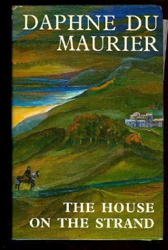

The House on the Strand cover

## Selected Quotes

> I remembered that the tide had been out, the stretches of flat sand exposed, the row of bathing-huts, lined like denture in an open mouth, forming a solid background to the golden expanse.
> 
> from _The House on the Strand_ -- _Chapter One_

> The small, pane-less windows gave little light, the aperture tight closed by oiled parchment, while the lighted candles standing on the trestle table at the bed's foot threw monstrous shadows on ochre-coloured walls.
> 
> from _The House on the Strand_ -- _Chapter Six_
