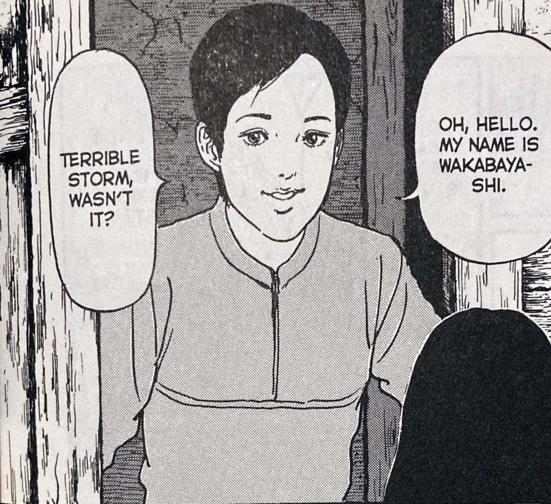
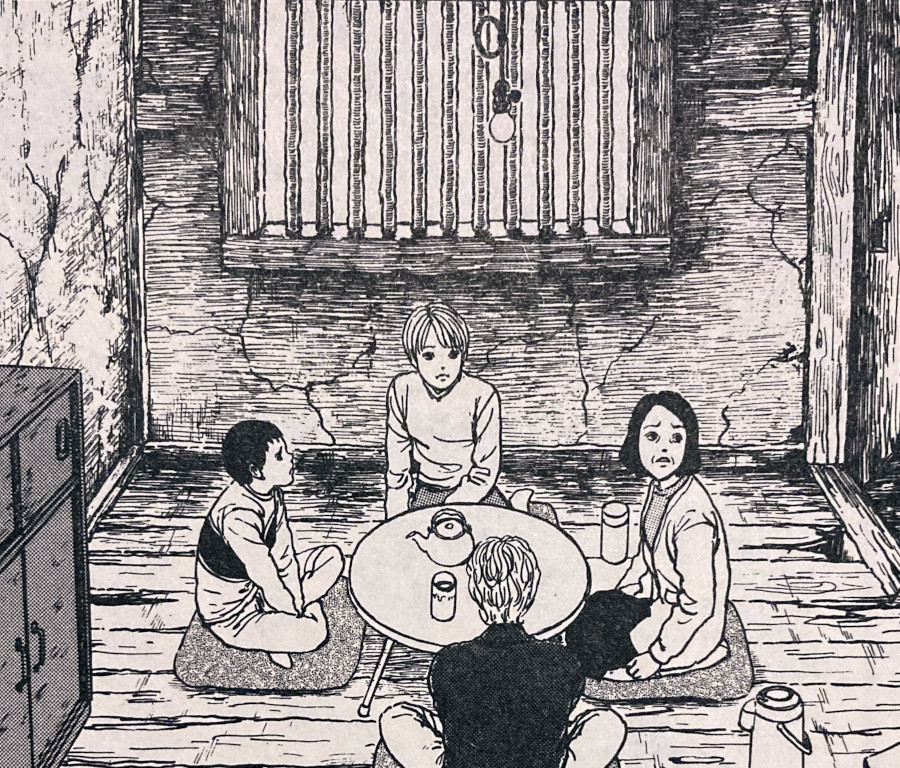
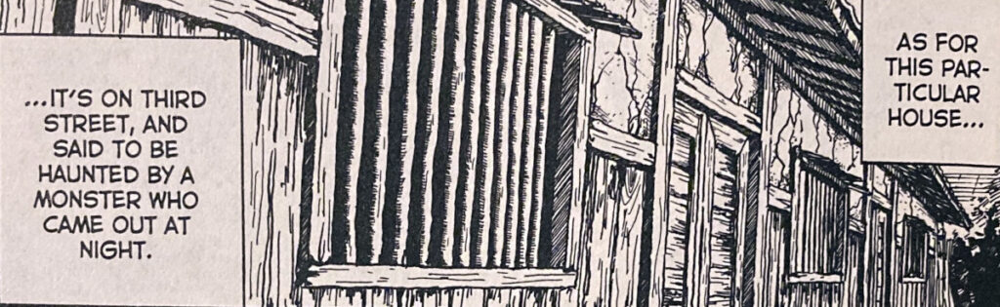
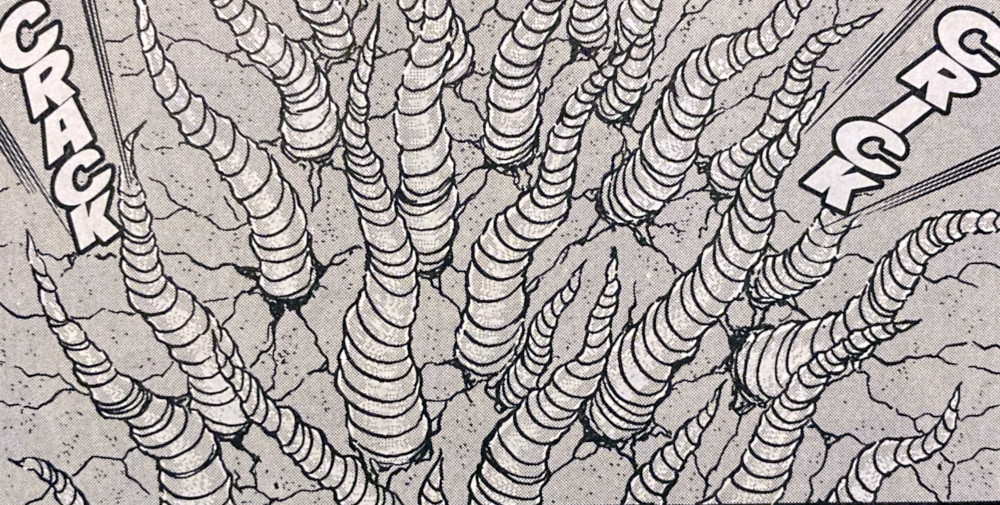

> The floor where her son slept was covered with small holes. Now what was that about?
> 
> Wakabayashi questions the strange goings on

## The House -- Synopsis

After the violent [storm](https://junjiitomanga.com/the-storm-uzumaki-part-12/) from the previous Uzumaki chapter, Kirie and her family have no choice but to find a new place to live. Their home, along with all others around Dragonfly Pond, have been completely destroyed by the Hurricane.

The house that they are presented with is an apartment in one of Kurouzu-cho's old row houses -- the same kind of row house as featured in the earlier chapter [Twisted Souls](https://junjiitomanga.com/twisted-souls-uzumaki-part-5/). Their new home is run down, dirty and barely hanging together. But it is their only option and they have no choice but to move in.

Immediately upon moving in, it becomes apparent that something is not quite right with the place. Kirie should have probably expected this based on her previous adventures in the town. Strange howling noises at night and the rumours of a haunting and / or monster that devours nearby missing dogs, are enough to keep the family on edge.

But will these rumours have any teeth? What are these strange markings that the family begin to show on their bodies? And will these markings become something much more sinister?

The Goshima's new neighbour Wakabayashi

The new Goshima home is a little run down

The run down row house

## Strange bodies

In this chapter we return to what Junji Ito is perhaps most known for -- his unique depictions of body horror. From the strange wart-like markings that Kirie's father begins to first exhibit, to the grotesque protrusions that come later. Along with one of the most imaginative monsters in the Uzumaki series.

I'm always impressed by just how much content and mystery Ito manages to pack into a lot of his stories. What we know is that the family is falling victim to some kind of local disease. And also that some kind of monster lurks somewhere within. But there is also a lot that we don't know.

Is that monster the only one of its kind, spreading its disease but devouring its victims? Or is it one of a line of them created by the town's spiral curse? Are the families within the row houses becoming like the monster themselves? Or are they just catching the disease as a result of the close proximity to the monster?

The answers to these questions don't really matter -- at least not to me. I always love it when a story opens more questions than it closes. It has the effect of deepening the world in which the story takes place. And there are few collections that I've read that are quite as deep as Uzumaki.

## Monster of the Week

The House has one of my favourite "monsters of the week" in it. A monster of the week refers to a TV series that would have an overarching storyline, but would often have a different monster (or another enemy) each week for the protagonists to fight.

(Kind of like [The X-Files](https://en.wikipedia.org/wiki/The_X-Files) or [Buffy the Vampire Slayer](https://en.wikipedia.org/wiki/Buffy_the_Vampire_Slayer)).

The monster in this chapter is also one of Junji Ito's most grotesque in my opinion. At least out of the stories I've read so far. Since we know where the monster's spiral tentacles have originated from, and that the nearby people are exhibiting similar symptoms, it made it all the more creepy for me.

The design of the monster as a whole was awesome too. Aside from maybe the blood-thirsty women of [Mosquitoes](https://junjiitomanga.com/mosquitoes-uzumaki-part-10/), the monster of The House felt like Junji Ito's most deadly creation yet. It even made me imagine some kind of later transformation of a creature from the [Resident Evil](https://en.wikipedia.org/wiki/Resident_Evil) game series.

The way in which the monster's spirals pushed their way in through the wall made me think of potatoes too. Stay with me a second. Those growths that potatoes get when left in the cupboard for too long. For the longest time those potato sproutings, although natural, really freaked me out. This monster pricked that same repulsion I think.

On first reading I thought that the healthy neighbour was the monster all along. I thought that he was just playing the Goshima Family for fools. However, on re-reading I noticed how he asks himself what is happening with his own hand as he transforms. Leading me to believe that he is just as unaware as the others.

What I found most interesting though, was just how his state escalated so quickly. He went from very early symptoms, to the fully-fledged spiral monster within moments. It seemed to me that it was somehow his lust for Kirie that became the catalyst for his transformation. His desires being revealed as he spies on her through his peep hole into their apartment. This being true, it would give the story a whole new subtext of a sexual nature.

## In Summary

I wont lie, I found the monster in The House quite creepy to look at. Sometimes you see a particular image that just gets under your skin. For me, it's creepiness was like that of another Ito story called "Greased" (which I'm yet to write about). There is just something about those little spiral warts that just turns my skin.

This would be a great first story to jump into for a taster of Junji Ito's style. The story is self-contained and gives just as much back story as is needed. And the body horror aspects, whilst being creepy and enough to almost turn _my_ stomach, aren't up in the realms of his more graphic depictions of horror.

I definitely put this into the top half of my favourites from Uzumaki. Not quite the top five, but definitely somewhere close.
