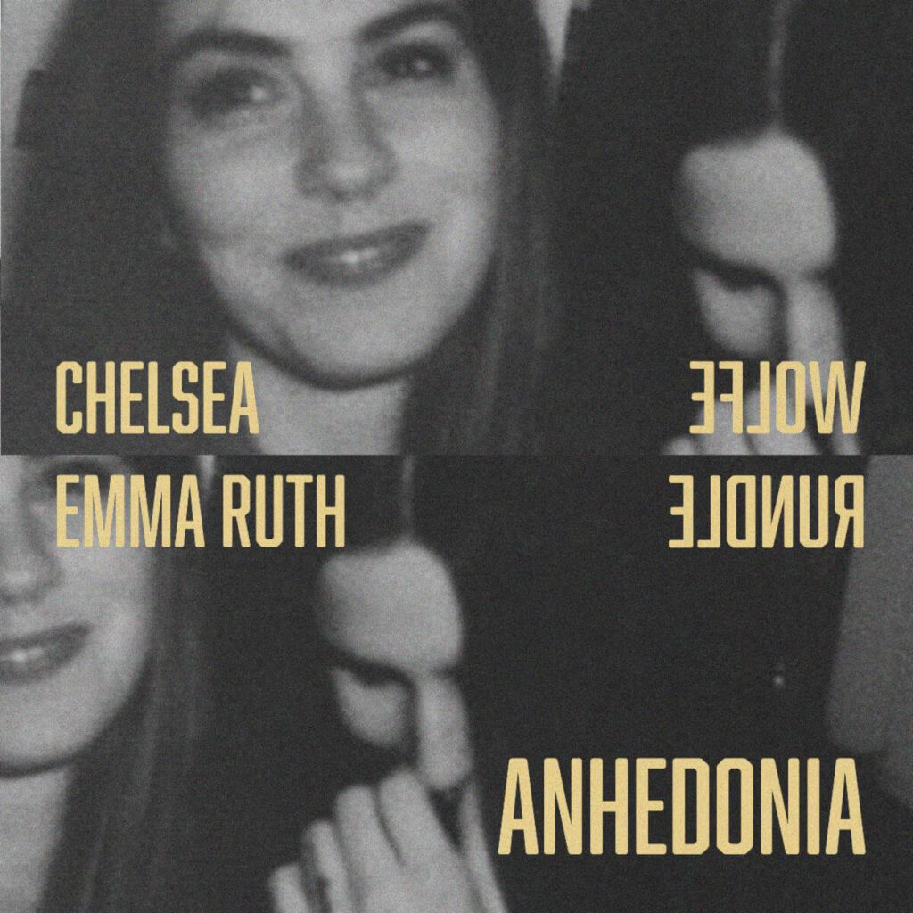

Beautiful haunting song.

Gave me similar vibes to parts of the Inland Empire and Mulholland Drive soundtrack.

There is a very specific song that it's reminding me of -- I just can't remember what song it is. As soon as I remember I'll update it here.

I think it is reminding me of "Llorando" -- the French version of Crying from Mulholland Drive.
