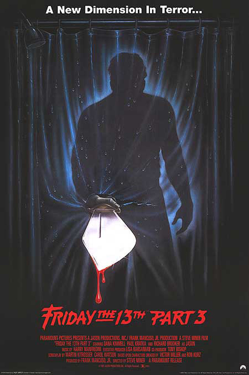

Friday the 13 part 3 was a lot of fun.  

I didn’t enjoy it quite as much on the whole as I did part 2, but it was still a great ride. And it was great to finally see Jason don his infamous hockey mask.  

I found myself wondering about the director’s taste when I kept noticing things being pointed right at the camera. Like in the camera’s face. It wasn’t until half way through that I had the distant memory come back about this film having been made for 3D.

Plus a pissed-off 80s biker gang. What’s not to love?
