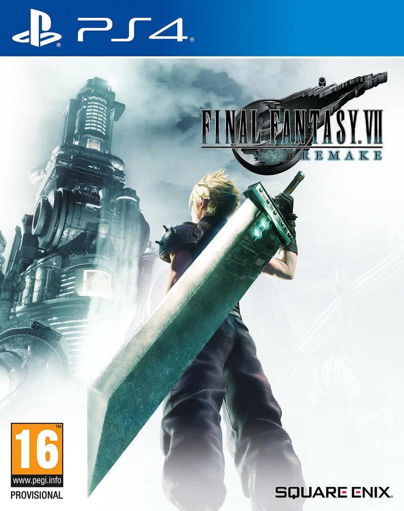

> Y'all have to look at the big picture here. Nothing worth fighting for was ever won without sacrifice.
> 
> \-- Barret Wallace

It felt like I had a weird mental journey through playing the Final Fantasy 7 remake.

It started with me absolutely loving the opening scenes -- the slow aerial shot into the mega-city of Midgar; the beautiful re-imagined image of Aerith down the alleyway.

It ended too with me absolutely loving it -- despite the fact that it covers only about the first 10% or so of the full FF7 story!

But there were a couple of moments within the story of remake where I just got a bit bored with it and stopped playing it for a couple of weeks.

However, on the whole I was not disappointed with the remake. Despite having waited about a year or so after its release to play it.

## All the vibez

The vibez in Final Fantasy 7 Remake were on point. I found myself getting emotional just through the opening cinematic. Being able to see close-up the people living in Midgar, before the infamous entering of the train at the reactor station, just filled me with the best feelings of nostalgia.

During that opening game play segment I was pumped up and ready to take it on. Everything was as i remembered -- except for the game's battle system. The games battle system I did not care for much, but I wont dwell too much on that.

As I mentioned above, there were the odd times I became a bit bored. But these tended to be around side quests and extended sections of certain parts of the story. Although in retrospect perhaps I was just in a rush to get the story moving forwards.

My boredom never came during story beats taken from the original game.

In fact, many of the moments that had been remade were even better in my opinion. The whole of Wall Street had been elevated into a place much bigger and brighter. And the characters too -- Don Corneo especially was developed far more in this one, with his character being much more creepy.

## Avalanche

You never heard the voices of the characters in the original Final Fantasy 7, so they pretty much sounded like how they did in your own head.

But once I heard Barret's deep voice bouncing off of Cloud's indifference in the remake, I knew the developers had captured these characters perfectly. Maybe it's just my imagination, but Barret sounded exactly how he had in my mind -- cloud not so much, but the way in which their relationship develops was as nicely done as I recall.

Tifa had that same hard edge as I'd remembered, along with the slight vulnerability. I didn't often control other characters during enemy battles, but Tifa was one I would sometimes -- punching an enemy before using a whirling uppercut was so cool.

And when it comes to Aerith, not enough good things can be said. She is perfect in this game. Her character is just so pure and you can't help but want to protect her, despite her being just as strong, if not more so, as the other members of Avalanche.

## As it was in my mind's eye

As a result of my extensive hours playing the original while I was a child, I have most of the original locations permanently etched into my mind. As such, I could always imagine how it would look from the characters perspective -- the original being a top-down perspective for the player.

And this remake again absolutely nailed it. Many areas of Midgar that I remember fondly had not only been remade and enhanced, but were perfectly as I remember imagining them.

The Seventh Heaven Bar; Aerith's House and garden; the park that Cloud and Aerith pass through. These were all places I remembered well and they all felt instantly recognizable when coming to them in the remake.

One place that I felt was without a doubt far superior in this remake was the Shinra headquarters. The entire building was utilized so much more -- and it looks absolutely stunning. New areas of Hojo's testing areas were added; the ascent up the tower was much more streamlined and with new and very engaging moments added in.

## Glorious music

The music was very nostalgic for me and yet had not just been ported over. The score was absolutely beautiful and stirred all the same feelings as it had done many years ago. Only now the orchestral scores had a much higher production value.

The moments when the Shinra theme kicks in. Or Sephiroth's iconic music fills the headphones. These moments were special back in the late 90s, and they felt special now.

I liked the inclusion of the collectable music discs in the game too. Hearing familiar final fantasy 7 pieces of music playing from a nearby jukebox was a nice touch. It was a good way of bringing in later aspects of the original game -- the Costa Del Sol theme is one that immediately springs to mind.

## In Summary

At the risk of sounding soppy, Final Fantasy 7 holds a very special place in my heart. It was one of the very few games I grew up playing in my formative years -- others being Resident Evil 2 and Metal Gear Solid. So remake this I was more skeptical than excited by the prospect.

In fact it took me a year or so to actually play the game. I just didn't _need_ a new version of the story -- the classic is perfect enough for me. Plus I don't believe they are going to get all of the story into the planned 3-part arc I believe this remake is planned to be.

However with that said, the Final Fantasy 7 Remake is a loving re-imagining of the classic RPG. I would have liked to have kept the static turn-based battle system as in the original. Something like how Persona 5 did their battles would have been the icing on the cake for me, but I guess you can't have it all.

I realize that pretty much all of my critique and opinions on the remake are going to stem from a place of comparison to the brilliant original. But I also can't help but feel that this game is best experienced with having all that nostalgia tied up in one's brain and heart.

Despite it feeling a little drawn out for me in some places, I still look back on the story of remake, on the whole, as being a good one, and one I will probably revisit soon.
