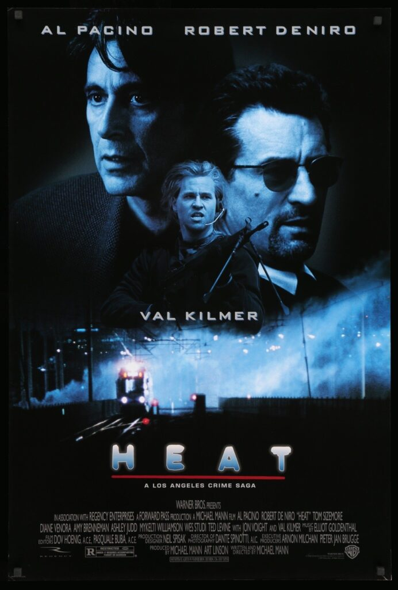
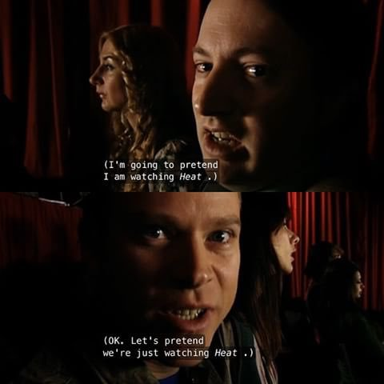
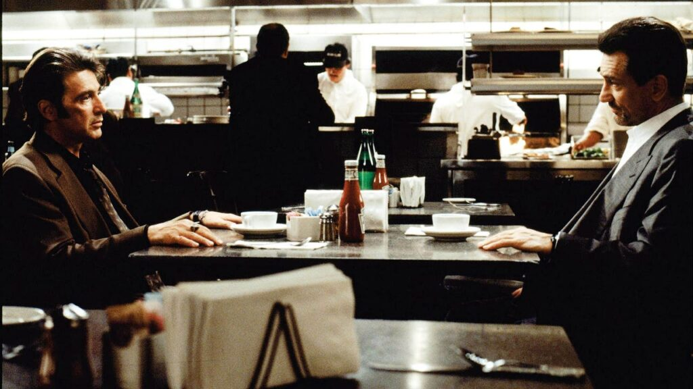

Finally watched this film for the first time and I absolutely loved it to bits.

As I sat there sweating through the UK heatwave -- my apartment being three or four degrees higher -- I became lost in this world of LA.

It goes without saying that Al Pacino and Robert Deniro are at the top of their games in this film, but i'm gonna say it anyway...

...they are both so fucking great. As are all the other performances throughout.

It's one of those films that has been on my radar for so long but just never got round to watching it. Everyone I'd heard mention it had always said it was awesome -- they were all right.

Deniro's character brought a certain intensity throughout for me -- his straight line, get the job done attitude is infectious.

And Pacino does what he does best. His seemingly-random outbursts of animation were such a joy to see. I found myself laughing -- but out of shear enjoyment of his performance. He has a way about him that just captures my attention with ease.

Mark and Jezz in Peep Show pretend to watch Heat whilst at a theatre show

Deniro's and Pacino's characters are two sides to the same coin. Both representing the opposing forces of law and criminal. I found myself rooting for both of them right till the end. Neither is completely "good" and neither is at all "evil".

Besides hearing Heat mentioned in one of my favourite TV shows, Peep show (see image above), what actually tipped me into actually sitting for the 2 hour 50 minute runtime was a clip of Tom Hiddleston on the Graham Norton show.

The clip featured Tom appearing with 3 other actors, all there for different reasons, but was sharing the guest sofa with no other than Robert Deniro. Tom was talking with admiration about Deniro in Heat -- and in one scene in particular.

The scene was the infamous coffee shop scene in which Deniro and Pacino enjoy their first ever on-screen appearance.

When I finally got to the scene myself I saw where that admiration was coming from.

Al Pacino and Robert De Niro in Heat.

One of the most conflicting moments for me came right near the end.

There is a chance for Deniro to get away and begin a fresh life, and I was really praying he would. However, I equally wanted him to finish off one piece of unfinished business -- with a particularly nasty character.

There's a moment where he's driving and you can feel the conflict within him. Deciding desperately which path he should take. And I think he already knows the outcome of both paths before he chooses.

I wont spoil that moment for you here, but I do urge you strongly to watch this. It's an incredible film.
