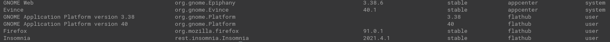

List out all of your installed Flatpaks and copy the "Application ID" for the Flatpak you want to give home directory access to.

```
$ flatpak list
```

[](images/Screenshot-from-2021-08-23-15-14-27.png)
[](images/Screenshot-from-2021-08-23-15-14-27.png)

Part of a Flatpak listing

Let's assume we want to give the program "Insomnia" access to our home directory when it is used.

The second column is the Application ID.

The application ID for Insomnia is `rest.insomnia.Insomnia`.

To give Insomnia access to your home directory, run the following:

```
flatpak override --user --filesystem=home rest.insomnia.Insomnia
```

## Notes

My knowledge of Flatpaks is limited so apologies if I end up being incorrect here.

Flatpak'ed programs are self-contained installations that are sheltered from the system they are installed on. (Linux / security geeks may need to correct me here).

By default, they don't have access to the filesystem of your computer.

I needed to give my own installation of Insomnia access to my system (just the home directory in my case) so that I could upload a file to it. The command above gives me that result.

## Other online tutorials

There are some tutorials I've seen online that mention similar solutions, except using `sudo` and _not_ including the `--user` flag. This didn't give me the result I was needing.

You see, without the `--user` flag, the command will try to update the Flatpak's global configuration -- which is why it needs `sudo` privileges.

But by using the `--user` flag, we are only affecting the configuration for the current user, and so the `sudo` is not needed.
