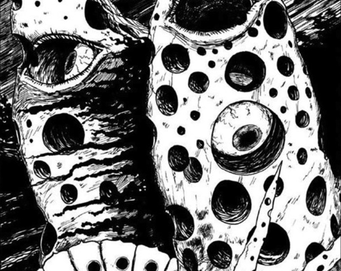

In Shiver we join a young boy named Yuji. One day Yuji is sat in his room when he hears a scream from the house next door. The scream is coming from the young girl who lives there -- her name is Rina.

Yuji is recalling to his friend one day, how he sometimes sees that girl standing by her window. Often when she notices him looking she will point out towards the wild garden that is shared by both houses. It is then that Yuji will see all of the holes that run up Rina's arms.

As strange as it is, Yuji can't help but think of a distant memory of his own -- a memory he doesn't fully trust -- of his grandfather who had a similar illness brought upon him. His grandfather's illness was in fact a much worse case. as Yuji vaguely remembers.

One afternoon after explaining these things to his friend, Yuji is sat in his bedroom with that friend. It is then that they find the grandfather's old journal between the books left behind after his death.

Inside the journal the two friends may just find a clue as to the origins of this disease. But will it help them escape its effects? Will Rina succumb to the same fate as Yuji's grandfather? And just who is the strange doctor who seems to be making an appearance around the houses?

## Mystical origins and Insects

I like the strange, almost vague origins of the Jade Carving. Not knowing its complete history, only an idea about how it was obtained, gave the story a good amount of mystery. And the mention of the second world war from when it was discovered, tied the story to the real world all that bit more for me.

The fact that the carving is lost at the end too, along with the unknown whereabouts of the mystery doctor, give it a good hauntingly-open ending.

My favourite kind of ending.

Although I liked the inclusion of the strange doctor, nothing much is explored with him. And I'm not sure whether I would have wanted further exploration or not. I often tend to lean to the side of wanting mystery over an explanation for a story, and so can't really complain. But I'd be lying if I said I didn't want to see a bit more of the mysterious Doctor and his own origins.

Even though at its core it is simply a story of a cursed trinket, the way in which the curse takes effect is unique to Ito's imagination. Reading the artist's commentary at the end of the book gave insight into the origin of his idea. Through reading a book about insects and how they breath, he was able to conjure up these unforgettable visions of cursed people with holes all over their bodies.

We all have access to the same information, especially with the World Wide Web, but it's fascinating how certain people can take that same information and run in completely different directions.

## A Trypophobic Curse

[Trypophobia](https://en.wikipedia.org/wiki/Trypophobia) is the fear of holes, more specifically tightly-spaced holes, that cause a repulsion in the sufferer. And Ito manages to reach into the area of this fear with the curse that is featured heavily in Shiver. The characters themselves aren't shown to actually have this fear. However, I could imagine it having an adverse affect on those who do happen to suffer from it.

The curse that seems to be brought down upon the people in this story is a really interesting one too. I've seen curses of death and even a curse to lose weight in Stephen King's Thinner. But never a curse that bores holes into the flesh of the victims.

I also remember a recent chapter of Uzumaki -- [The House](https://junjiitomanga.com/the-house-uzumaki-part-13/) -- that features similar holes being made in the wooden flooring and walls of a run down wooden row house. That was enough to creep me out, but when they are appearing in ones own flesh it makes it ten times worse.

Even without a fear of holes, Shiver still manages to get under my skin, if you'll excuse the pun. The idea of feeling the wind whistling within your body giving you a titular "shiver" was enough to give me goosebumps itself.

And then the inclusion of the visions of insects swarming towards the grandfather as his story is revealed through the journal. I just couldn't help but imagine those insects crawling in and out of those holes. Burrowing between the layers of flesh; itching and biting; getting caught on the tendons and arteries beneath.

Junji Ito has a skill in creating certain repulsions from aspects of his work. This is pretty common in the genre he tends to work in; body horror. But that effect is made more potent, in my opinion, when it happens to younger, innocent characters. Rina for example, has no knowledge of the jade carving, let alone a desire to keep it. Her only crime was having her bedroom near the bush where the jade carving was lying beneath.

## In Summary

The title story from the Shiver Collection is not my favourite from that book, but it is no less worthy of your time. The imagery is as iconic as you would come to expect from the master, and will not be forgotten in a hurry after reading it.

Shiver is beautifully drawn -- especially the detailed panels that display the effects of the curse. Each hole is meticulous crafted to accurately show you what is beneath the skin. You may just feel the curse lifting off the page before you.

I believe this is one of Junji Ito's more milder stories. That is despite the curse that is creating holes in the bodies of those it affects. When compared to the more extreme visions in [Uzumaki](https://junjiitomanga.com/tag/uzumaki/) or the [Tomie](https://junjiitomanga.com/tag/tomie-collection/) series, for example.

However, if you do happen to be a sufferer of Trypophobia then your point of view may be completely different to mine on that matter.
