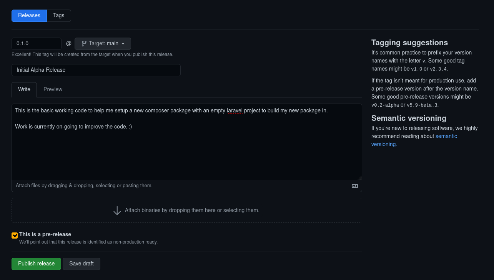
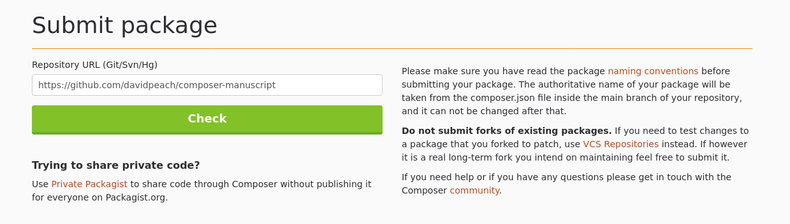
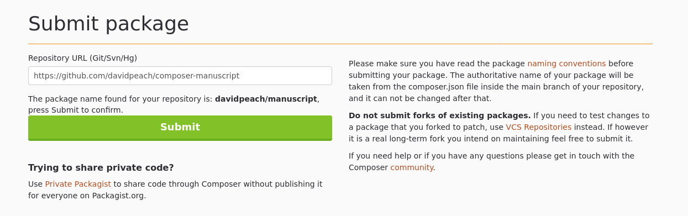

```
git init
echo "vendor" > .gitignore
git add .
git commit -m 'Initial Commit'
git remote add origin git@github.com:_YOUR_USERNAME_/_YOUR_PACKAGE_NAME_.git
git branch -M main
git push -u origin main
```

## In Github

Go to "create a new release" and fill in the form.

Here is an example of the form from a recent project of mine:

[](https://davidpeach.co.uk/wp-content/uploads/2023/05/Screenshot-from-2021-05-23-08-06-11.png)

## On packagist

Setup your packagist account with access tokens etc.

Go to submit package, paste in the URL to your package's repository and click "check".

[](https://davidpeach.co.uk/wp-content/uploads/2023/05/Screenshot-from-2021-05-23-08-23-52.png)

Packagist submit package screen -- with the check button

When you click "check", it will go off and attempt to find the package at that URL.

[](https://davidpeach.co.uk/wp-content/uploads/2023/05/Screenshot-from-2021-05-23-08-25-35.png)

Packagist submit package screen -- package found at URL and ready to submit

Once you have click "Submit", you should be presented with your package's new packagist homepage:
